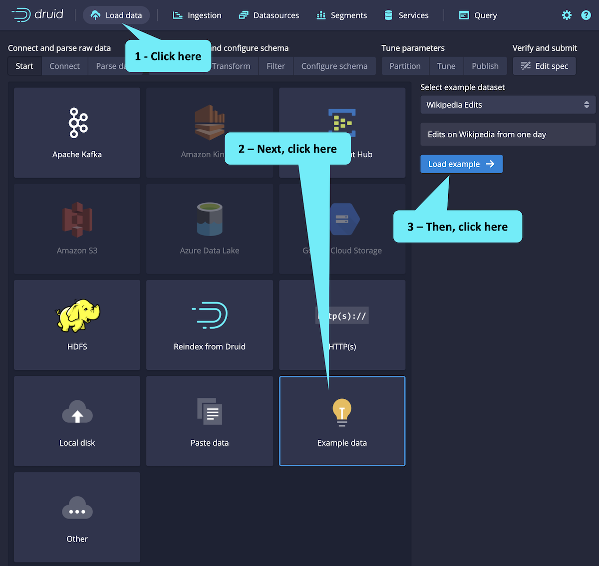
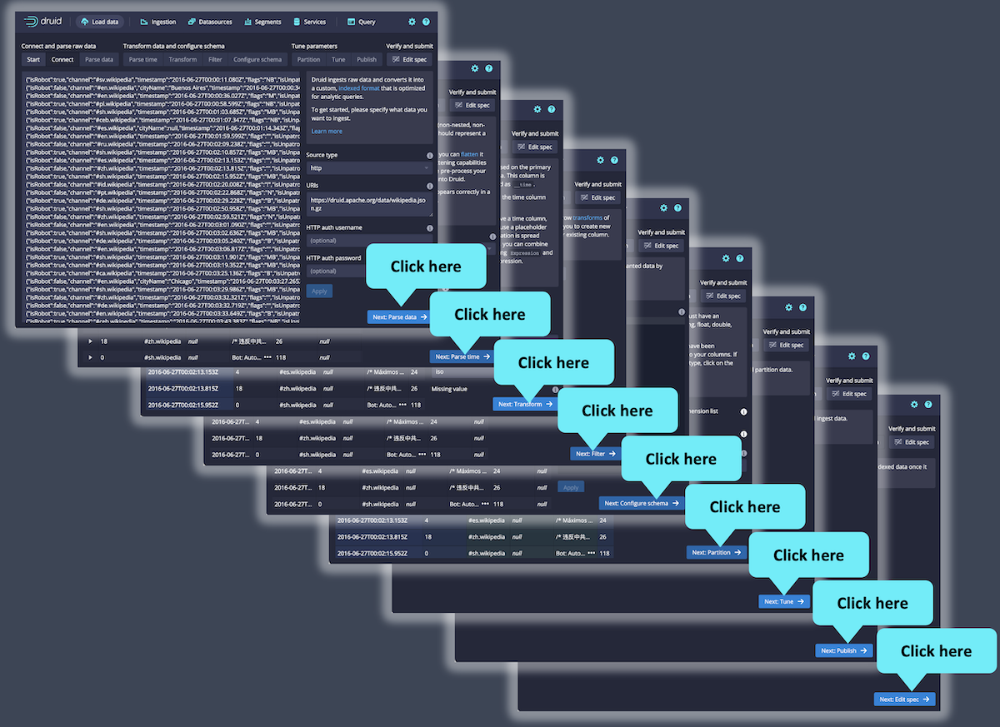
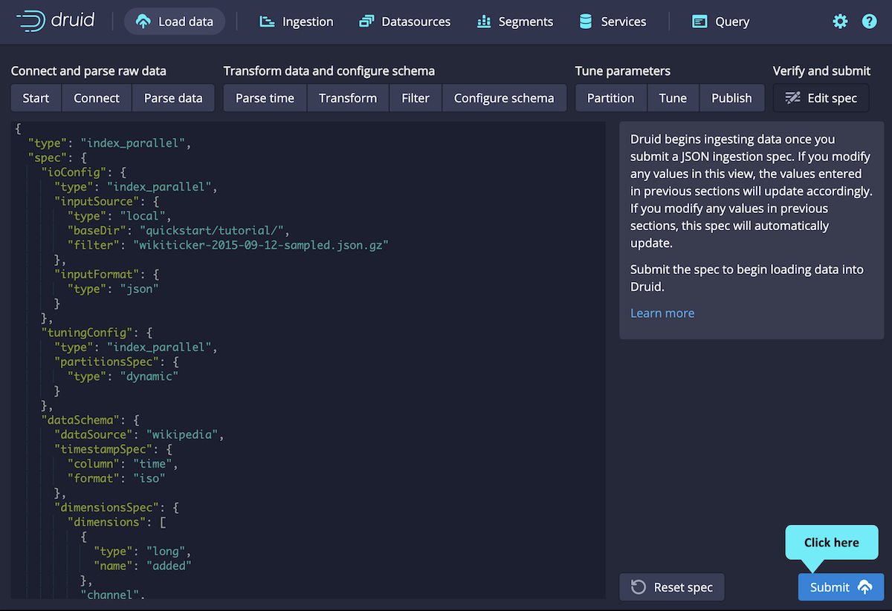

<strong><em>NOTE:</em></strong> <i>If you have previously completed the Try-it-out track, you will find that the last two steps of this track are identical to those in the Try-it-out track.
This is to demonstrate that the scaled up cluster shown in this track works the same as a single-server installation.
Also, you may not notice a performance improvement using the larger cluster.
This is due to the small amount of data we are using in our educational examples.</i>

<h2 style="color:cyan">Step 1</h2>

Load data by clicking as shown.

<h2 style="color:cyan">Step 2</h2>

The console walks you through the ingestion steps.
Since we are using example data, we can just accept the defaults by clickng the _Next:-_ buttons.

<strong><em>NOTE:</em></strong> <i>The focuses of this track is Druid deployment.
So, we will not cover the details of ingestion.
But, the purpose of the previous screens through which we wildly clicked was to build an ingestion specification.
You can review the JSON ingestion specification on left side of this final screen.</i>

<h2 style="color:cyan">Step 3</h2>

Finally, click _Submit_ to ingest the data.

The ingestion takes a minute or so.
You will know Druid has written the segments to deep storage when you see the _SUCCESS_ status.

<h2 style="color:cyan">Step 4</h2>

After Druid writes the segments to deep storage, it then loads the segments for querying.
You can tell the segments are loaded and ready when you see this (you may need to refresh the browser tab a few times).

<h2 style="color:cyan">Wow! You have ingested the data!</h2>

