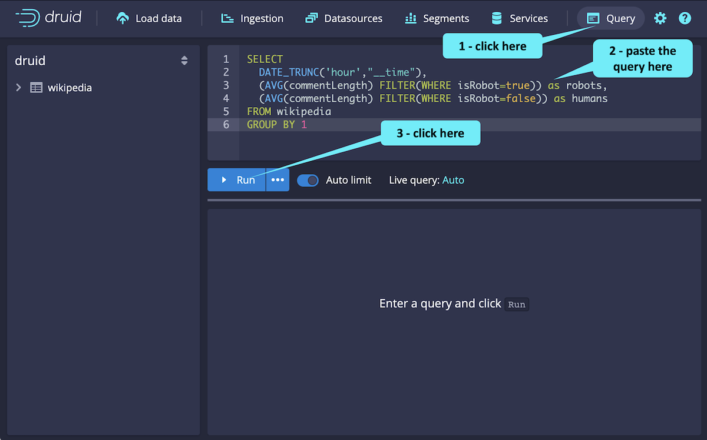

With Druid running and data ingested, let's return to the Druid console.


<h2 style="color:cyan">Step 1</h2><hr style="color:cyan;background-color:cyan;height:2px">

This data is about updates to Wikipedia during a one day period.
Both people and robots contributed to the updates.


Suppose you want to know how updates vary for humans and robots over time.
Here's a query that can help you answer that question.

```
SELECT
  DATE_TRUNC('hour',"__time"),
  (AVG(commentLength) FILTER(WHERE isRobot=true)) as robots,
  (AVG(commentLength) FILTER(WHERE isRobot=false)) as humans
FROM wikipedia
GROUP BY 1
```

Click on the _Query_ tab, paste the query in the console and run it as shown.
Then, check out the results.

<a href="#img-1">
  
</a>

<a href="#" class="lightbox" id="img-1">
  
</a>

<h2 style="color:cyan">Amazing! Druid queries are easy!</h2>

<style type="text/css" rel="stylesheet">
.lightbox { display: none; position: fixed; justify-content: center; align-items: center; z-index: 999; top: 0; left: 0; right: 0; bottom: 0; padding: 1rem; background: rgba(0, 0, 0, 0.8); }
.lightbox:target { display: flex; }
.lightbox img { max-height: 100% }
.thumbnail:hover {
    position:fixed;
    top:-25px;
    left:-35px;
    width:500px;
    height:auto;
    display:block;
    z-index:999;
}
</style>
