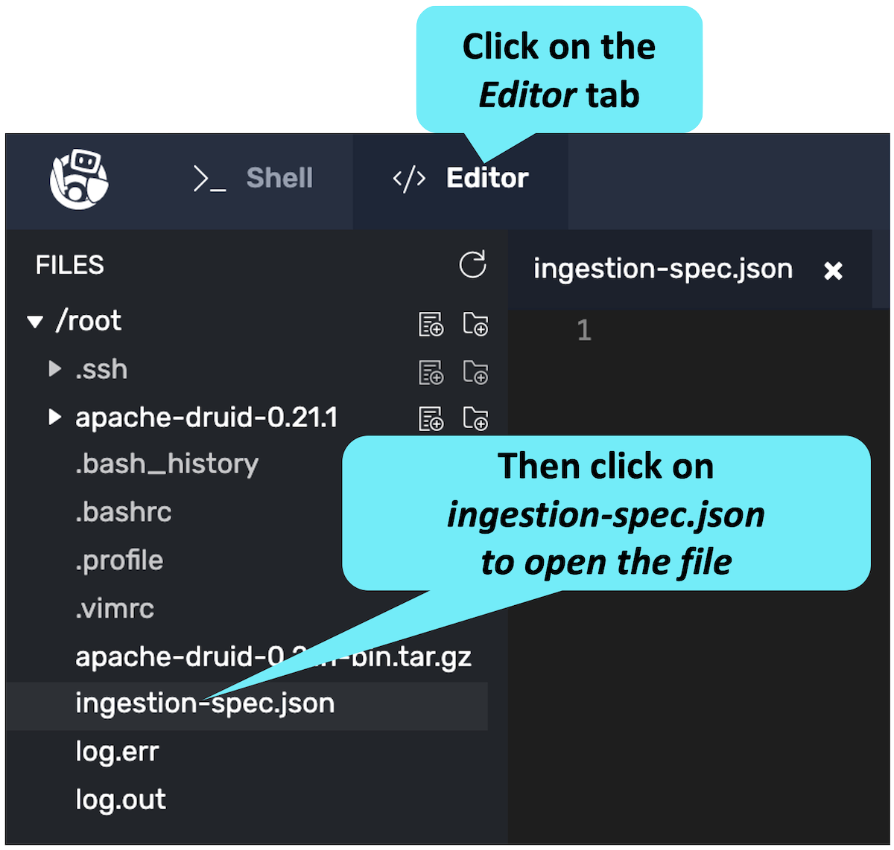
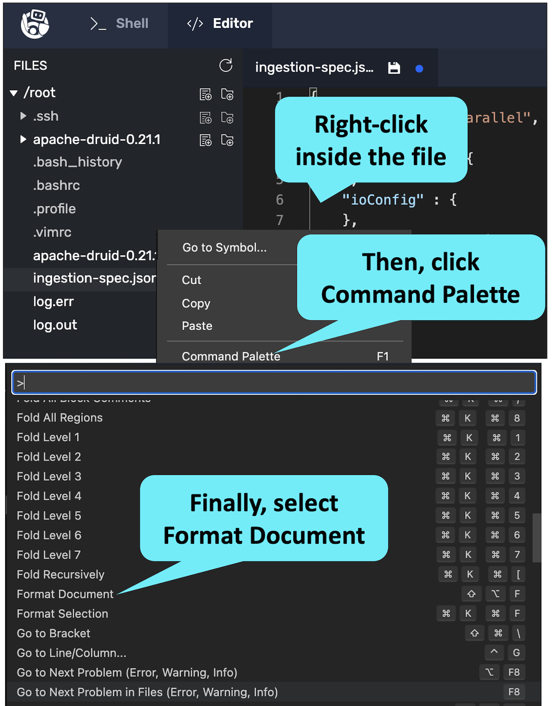
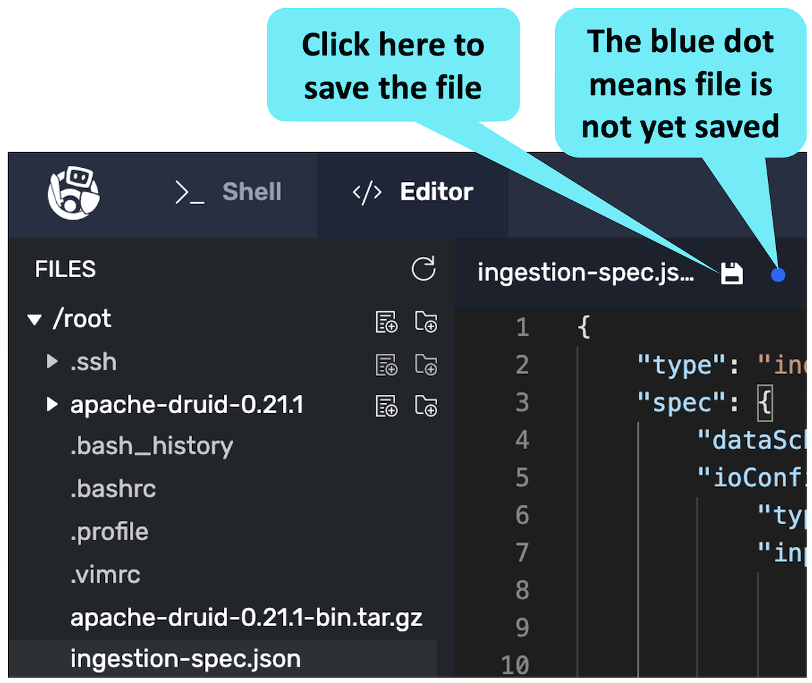

For this track, we have installed and launched a single-server Apache Druid® system.

<h2 style="color:cyan">Step 1</h2><hr style="color:cyan;background-color:cyan;height:2px">

Review the running Druid processes with the following command.

```
ps -ef | grep "Main server [A-Za-z]*$" | awk 'NF{print $NF}'
```

<h2 style="color:cyan">Step 2</h2><hr style="color:cyan;background-color:cyan;height:2px">

Take a look at the format of the raw data we want to ingest.

```
head --lines 1 /root/apache-druid-0.21.1/quickstart/tutorial/wikiticker-2015-09-12-sampled.json | jq
```

<h2 style="color:cyan">Step 3</h2><hr style="color:cyan;background-color:cyan;height:2px">

The previous command only shows the first line of the file.
Do you want to know how many lines there are in the file?

```
wc -l /root/apache-druid-0.21.1/quickstart/tutorial/wikiticker-2015-09-12-sampled.json
```

Let's build the ingestion spec.
Here is the [documentation for the ingestion spec](https://druid.apache.org/docs/latest/ingestion/native-batch.html).
We'll build this in a top-down fashion, a piece at a time.

<hr style="background-color:cyan">
<p><span style="color:cyan"><strong><em>NOTE:</em></strong></span> <i>You could also use the Druid Console to create the ingestion spec as we did in the Try Druid track.
But for this track, we are going to build the ingestion spec manually in an editor so that we can explore each section.</i></p>
<hr style="background-color:cyan">

<h2 style="color:cyan">Step 4</h2><hr style="color:cyan;background-color:cyan;height:2px">

Open the ingestion spec in the editor.

<a href="#img-4">
  
</a>

<a href="#" class="lightbox" id="img-4">
  
</a>

Let's create the general outline of the ingestion spec with the two top-level sections.
- _type_ with value *index_parallel*, which indicates batch ingestion.
- _spec_ which will contain the remainder of the ingestion spec.

<h2 style="color:cyan">Step 5</h2><hr style="color:cyan;background-color:cyan;height:2px">

Paste the following in the ingestion spec file.

```
{
  "type" : "index_parallel",
  "spec" : {}
}
```

Within the _spec:_ section, we will add three subsections.
- _dataSchema_ defines the datasource (i.e., table)
- _ioConfig_ describes the raw data input source
- _tuningConfig_ configures tuning parameters like segment size limits

<h2 style="color:cyan">Step 6</h2><hr style="color:cyan;background-color:cyan;height:2px">

Insert the labels for all three subsections by copying the following and replacing the empty _spec:_ section.

<details>
  <summary style="color:cyan"><b>Want a hint on how to replace sections in the file? Click here.</b></summary>
<hr style="background-color:cyan">
To replace a section in the file, like the `spec : {}` section, first click the solution text to copy the text to your clipboard.
Then, highlight the text you want to replace, and paste the text from your clipboard.
<hr style="background-color:cyan">
</details>


```
  "spec" : {
    "dataSchema" : {},
    "ioConfig" : {},
    "tuningConfig" : {}
  }
```

<details>
  <summary style="color:cyan"><b>Need an easy way to format the JSON? Click here.</b></summary>
<hr style="background-color:cyan">
It's easy to reformat the file. Right-click inside the file, select Command Pallette, then scroll down and select Format Document.
<a href="#img-6">
  
</a>
<a href="#" class="lightbox" id="img-6">
  
</a>
<hr style="background-color:cyan">
</details>


Below is what the ioConfig subsection looks like.
Learn more about ioConfig [here](https://druid.apache.org/docs/latest/ingestion/native-batch.html#ioconfig).

Note the following:
- _type_ is always <i>index_parallel</i> for batch ingestion
- _inputSource_ tells the ingestion process how to find the raw input file
  - _type_ is _local_ meaning the input is on the local file system - alternatively we could use _http_ if the input is from a URL
  - _baseDir_ is the local directory containing the input file
  - _filter_ contains the file name (or regular expression for input source files)
- _inputFormat_ describes the format of the file we will ingest, which could be JSON, CSV, TSV, etc. Learn more [here](https://druid.apache.org/docs/latest/ingestion/data-formats.html#input-format)
- _appendToExisting_ is false, meaning we want to overwrite the datasource/table contents, if any.

<h2 style="color:cyan">Step 7</h2><hr style="color:cyan;background-color:cyan;height:2px">

Replace the empty _ioConfig_ section in the spec with the following.

```
  "ioConfig" : {
    "type" : "index_parallel",
    "inputSource" : {
      "type" : "local",
      "baseDir" : "/root/apache-druid-0.21.1/quickstart/tutorial/",
      "filter" : "wikiticker-2015-09-12-sampled.json"
    },
    "inputFormat" :  {
      "type": "json"
    },
    "appendToExisting" : false
  },
```

<h2 style="color:cyan">Step 8</h2><hr style="color:cyan;background-color:cyan;height:2px">

Save the file.

<a href="#img-8">
  
</a>

<a href="#" class="lightbox" id="img-8">
  
</a>

One last point: sometimes as part of the ingestion process, it is necessary to flatten the data to convert the input format to the Druid segment format.
We can specify how to flatten the data as part of the _inputFormat_ section.


Our example data does not require flattening (because there are no nested fields).
But, you can read more about flattening [here](https://druid.apache.org/docs/latest/ingestion/data-formats.html#flattenspec).


<hr style="background-color:cyan">
<p><span style="color:cyan"><strong><em>NOTE:</em></strong></span> <i>If you have problems building the ingestion spec during any of these challenges, you can click the Skip link in the bottom right corner and we will fix the spec for you.</i></p>
<hr style="background-color:cyan">

<h2 style="color:cyan">Great! That takes care of the ioConfig subsection!</h2>

<style type="text/css" rel="stylesheet">
.lightbox { display: none; position: fixed; justify-content: center; align-items: center; z-index: 999; top: 0; left: 0; right: 0; bottom: 0; padding: 1rem; background: rgba(0, 0, 0, 0.8); }
.lightbox:target { display: flex; }
.lightbox img { max-height: 100% }
.thumbnail:hover {
    position:fixed;
    top:-25px;
    left:-35px;
    width:500px;
    height:auto;
    display:block;
    z-index:999;
}
</style>
