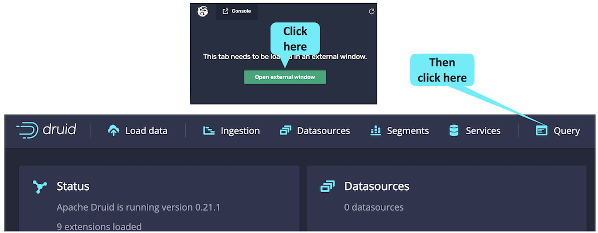
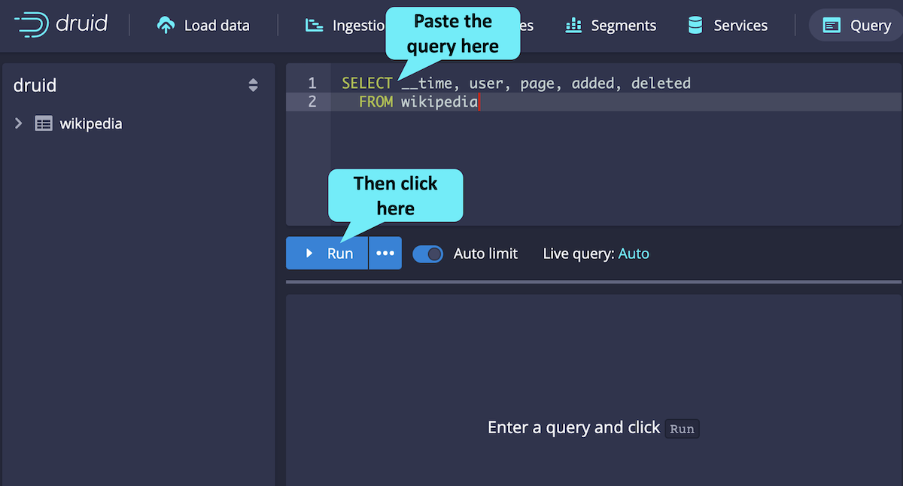
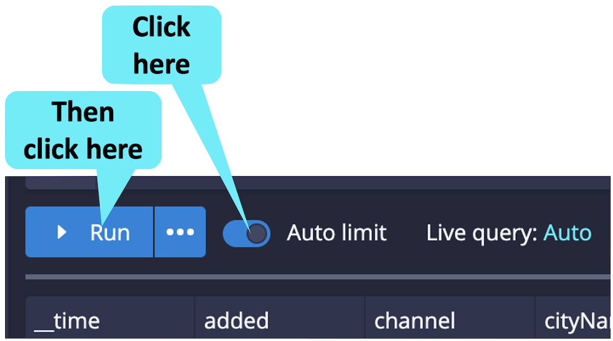
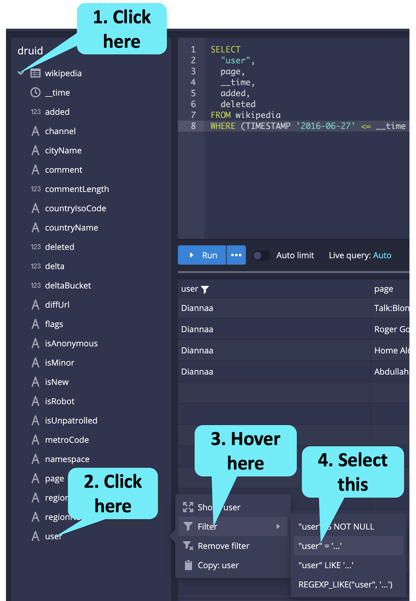
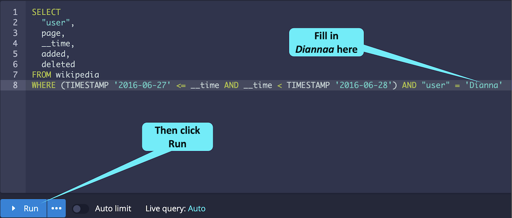
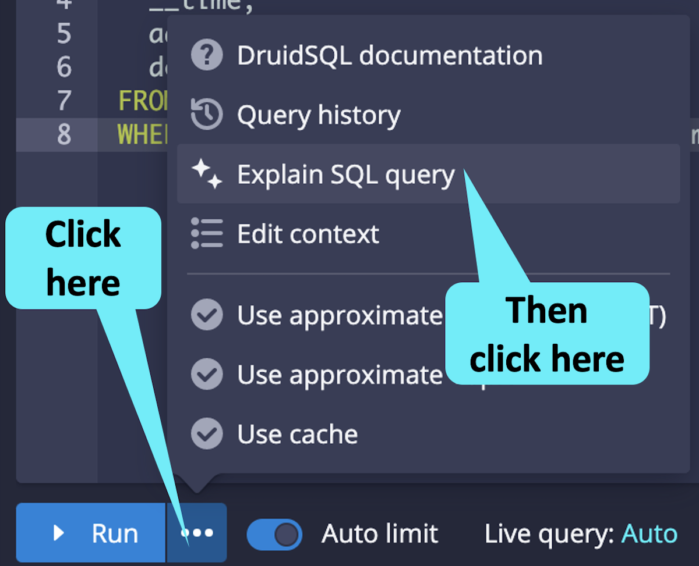
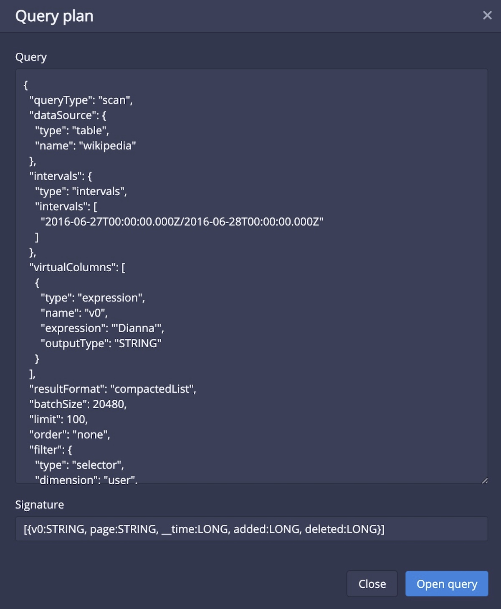

In this challenge we'll query the example Wikipedia data using the Druid Console.
We have already ingested the data for you, so let's do a query!

<h2 style="color:cyan">Step 1</h2><hr style="color:cyan;background-color:cyan;height:2px">

Click on the query tab in the console.

<a href="#img-1">
  
</a>

<a href="#" class="lightbox" id="img-1">
  
</a>

<h2 style="color:cyan">Step 2</h2><hr style="color:cyan;background-color:cyan;height:2px">

Copy the following query, paste it in the query window and click the _Run_ button.

<details>
  <summary style="color:cyan"><b>What does this query do?</b></summary>
<hr style="background-color:cyan">
This query retrieves only certain columns (<i>__time</i>, <i>user</i>, <i>page</i>, <i>added</i>, <i>deleted</i>) for a single day (June 27, 2016).
We use this query to show who was changing which Wikipedia pages on June 27, 2016.
<br><br>
It turns out that the only data we have in the table data source is from June 27, 2016, but we filter on the <i>__time</i> column to demonstrate best practices.
<hr style="background-color:cyan">
</details>


```
SELECT __time, user, page, added, deleted
  FROM wikipedia
  WHERE (TIMESTAMP '2016-06-27' <= __time AND __time < TIMESTAMP '2016-06-28')
```

<a href="#img-2">
  
</a>

<a href="#" class="lightbox" id="img-2">
  
</a>


<hr style="background-color:cyan">
<p><span style="color:cyan"><strong><em>NOTE:</em></strong></span> <i>It is a Druid best-practice always to filter by __time.
Not doing so runs the risk of overwhelming the cluster for large table data sources.</i></p>
<hr style="background-color:cyan">

You may have noticed that you only see about one hundred resulting rows from the query.
This is because of the _Auto limit_ feature.

<h2 style="color:cyan">Step 3</h2><hr style="color:cyan;background-color:cyan;height:2px">

Turn _Auto limit_ off by clicking on it, and rerun the query to see all the results.

<a href="#img-3">
  
</a>

<a href="#" class="lightbox" id="img-3">
  
</a>

The Console helps you build queries.
Let's modify the query using the helpful Console features.

<h2 style="color:cyan">Step 4</h2><hr style="color:cyan;background-color:cyan;height:2px">

Click on the data source name (i.e., wikipedia), then click on the first option.

<a href="#img-4">
  
</a>

<a href="#" class="lightbox" id="img-4">
  
</a>

You see that the Console populates the list of selected columns with all the columns in the data source, and executes the query.

<h2 style="color:cyan">Step 5</h2><hr style="color:cyan;background-color:cyan;height:2px">

Let's pare-down the list of columns to the ones we had before (<i>__time</i>, <i>user</i>, <i>page</i>, <i>added</i>, <i>deleted</i>).

```
SELECT
  __time,
  "user",
  page,
  added,
  deleted
FROM wikipedia
WHERE (TIMESTAMP '2016-06-27' <= __time AND __time < TIMESTAMP '2016-06-28')
```

After you have adjusted the list of columns, add a filter to only look at a single _user_.

<h2 style="color:cyan">Step 6</h2><hr style="color:cyan;background-color:cyan;height:2px">

Click to expand the list under _wikipedia_.
Then, click on _user_, hover over the _Filter_ option and click on _"user"='...'_.

<a href="#img-6">
  
</a>

<a href="#" class="lightbox" id="img-6">
  
</a>

<h2 style="color:cyan">Step 7</h2><hr style="color:cyan;background-color:cyan;height:2px">

Fill in the user value with the following and run the query.

```
Diannaa
```

<a href="#img-7">
  
</a>

<a href="#" class="lightbox" id="img-7">
  
</a>

Let's look at one more feature of the Druid Console.

<h2 style="color:cyan">Step 8</h2><hr style="color:cyan;background-color:cyan;height:2px">

Click on the elipses next to the _Run_ button.
Then click on _Explain SQL query_.

<a href="#img-8-1">
  
</a>

<a href="#" class="lightbox" id="img-8-1">
  
</a>

You will see a pop-up window containing JSON.

<a href="#img-8-2">
  
</a>

<a href="#" class="lightbox" id="img-8-2">
  
</a>

This JSON is a _native query_.
We will not cover the details of native queries in this track, other than to make you aware of them.

Feel free to explore the Druid Console _Query_ tab by creating your own queries.
You will notice that the Druid Console helps you create filters, and also gives you command completion prompts.

If you want more info on Druid queries using the console, check out this [tutorial](https://druid.apache.org/docs/latest/tutorials/tutorial-query.html).

<h2 style="color:cyan">Wow! Console queries are easy!</h2>

<style type="text/css" rel="stylesheet">
.lightbox { display: none; position: fixed; justify-content: center; align-items: center; z-index: 999; top: 0; left: 0; right: 0; bottom: 0; padding: 1rem; background: rgba(0, 0, 0, 0.8); }
.lightbox:target { display: flex; }
.lightbox img { max-height: 100% }
.thumbnail:hover {
    position:fixed;
    top:-25px;
    left:-35px;
    width:500px;
    height:auto;
    display:block;
    z-index:999;
}
</style>
