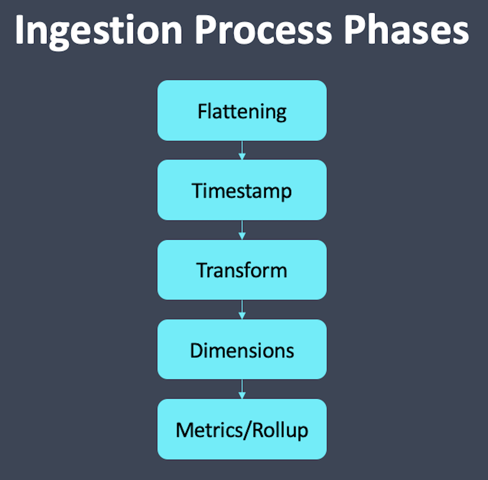

The _dimensionSpec_ is part of the _dataSchema_ and during ingestion, Druid processes it after the _transformSpec_, but before the _metricsSpec_.
In this exercise, we'll build a _dimensionSpec_.




Find the docs on _dimensionsSpec_ [here](https://druid.apache.org/docs/latest/ingestion/ingestion-spec.html#dimensionsspec).


<details>
  <summary style="color:cyan"><b>Are you new to these exercises? Click here for instructions.</b></summary>
<hr style="color:cyan">
These exercises allow you to actually <i>do</i> the tasks involved in learning Druid within the comfort of your browser!<br><br>
Click on the command boxes to copy the commands to your clipboard.
Then, paste the commands in the terminal to execute them.<br><br>
Some of the steps of the exercise will require using browser tabs external to the exercise tab.
When necessary, the exercise will explain how to open these external tabs.
When working in other browser tabs, you will want to switch back and forth between the tabs.<br><br>
That's all there is to it! Enjoy!
<hr style="color:cyan">
</details>

<h2 style="color:cyan">Step 1</h2><hr style="color:cyan;background-color:cyan;height:5px">

Let's create some raw data that we can ingest.

We have provided a Bash script that monitors the Druid processes and emits process CPU and memory utilization (feel free to open the script in the editor and peruse it if you like).


Run the following command to generate the data. This script will take 10+ seconds to run.

```
/root/process-monitor-producer.sh ISO 100 > /root/raw_data.csv
```

<h2 style="color:cyan">Step 2</h2><hr style="color:cyan;background-color:cyan;height:5px">

Let's inspect the data we just created using the following command.

```
head -10 /root/raw_data.csv \
   | column -t -s,
```

Observe the following about the data:
<ul>
  <li>The first field is an ISO formatted timestamp with millisecond granularity</li>
  <li>The second field contains the process ID</li>
  <li>The third field is a string that contains the process name</li>
  <li>The fourth field is a floating point value showing the CPU utilization</li>
  <li>The fifth field is also a floating point value showing the memory utilization</li>
</ul>

Let's look at how to treat each of these fields within the _dimensionsSpec_.

<p><span style="color:cyan"><strong><em>NOTE: </em></strong></span><i>In other exercises, we aggregated data, but in this exercise we will keep the raw data format so we can demonstrate some of the capabilities of the dimensionSpec.
</i></p>

<h2 style="color:cyan">Step 3</h2><hr style="color:cyan;background-color:cyan;height:5px">

Switch to the editor tab.


<h2 style="color:cyan">Step 4</h2><hr style="color:cyan;background-color:cyan;height:5px">

Open the ingestion spec file.


<h2 style="color:cyan">Step 5</h2><hr style="color:cyan;background-color:cyan;height:5px">

Let's start by creating an empty _dimensions_ list within the _dimensionsSpec_.
Find the _dimensionsSpec_ and add the _dimensions_ list.

<details>
  <summary style="color:cyan"><b>Need more help?</b></summary>
<hr style="color:cyan">
You want the dimensions spec to look like this:
<pre><code>"dimensionsSpec" : {
  "dimensions": [
  ]
}
</code></pre>
<hr style="color:cyan">
</details>


Now, let's look at each of the raw data fields.

<p><span style="color:cyan"><strong><em>NOTE: </em></strong></span><i>The time field requires special handling during ingestion and is not included in the dimensionsSpec.
Instead, the timestampSpec handles the time field.
</i></p>

Dimensions can have one of four types:
- _string_ - consisting of a sequence of characters
- _long_ - number with no decimal point
- _float_ - number with decimal point, stored in 32 bits
- _double_ - number with decimal point, stored in 64 bits, which allows for more precision than _float_

<p><span style="color:cyan"><strong><em>NOTE: </em></strong></span><i>By default, string fields have a bitmap index which facilitates query processing.
Other data types do not have the bitmap index.
</i></p>

<h2 style="color:cyan">Step 6</h2><hr style="color:cyan;background-color:cyan;height:5px">

The simplest dimensions to create are dimensions of type _string_.
To create these dimensions, we merely include the name of the field in the _dimensions_ list.

For example, we can store the _processName_ field as a string.
Add _processName_ to the _dimensions_ list.

<details>
  <summary style="color:cyan"><b>Need more help?</b></summary>
<hr style="color:cyan">
The dimensions spec should look like this:
<pre><code>"dimensionsSpec" : {
  "dimensions": [
    "processName"
  ]
}
</code></pre>
<hr style="color:cyan">
</details>

<h2 style="color:cyan">Step 7</h2><hr style="color:cyan;background-color:cyan;height:5px">

Next, consider the process ID.
Of course, the process ID is a number, but we don't ever really treat it as a number.
For example, we will never search for a process ID greater than 100.

Since we will not use the process ID as a number, and since Druid handles strings exceptionally well, let's store the process ID as a string.

<p><span style="color:cyan"><strong><em>NOTE: </em></strong></span><i>Numbers that we treat as IDs should be stored as strings. This allows Druid to compress the ID as well as create bitmap indexes to speed up processing.
</i></p>

Add _pid_ to the _dimensions_ list.

<details>
  <summary style="color:cyan"><b>Need more help?</b></summary>
<hr style="color:cyan">
The dimensions spec should look like this:
<pre><code>"dimensionsSpec" : {
  "dimensions": [
    "processName",
    "pid"
  ]
}
</code></pre>
<hr style="color:cyan">
</details>

<p><span style="color:cyan"><strong><em>NOTE: </em></strong></span><i>Elements of the dimensions list are comma separated.
</i></p>

<h2 style="color:cyan">Step 8</h2><hr style="color:cyan;background-color:cyan;height:5px">

The _cpu_ and _memory_ fields are floating point numbers and we may want to treat them as numbers.
So in the dimensions list, we will create a couple of simple objects that specifies this type.

The objects look as follows:

```
{
  "name": "cpu",
  "type": "float"
},
{
  "name": "memory",
  "type": "float"
}
```

Add these objects to the _dimensions_ list.

<details>
  <summary style="color:cyan"><b>Need more help?</b></summary>
<hr style="color:cyan">
Here's what your <i>dimensions</i> list should look like at this point:
<pre><code>"dimensionsSpec" : {
  "dimensions": [
    "processName",
    "pid",
    {
      "name": "cpu",
      "type": "float"
    },
    {
      "name": "memory",
      "type": "float"
    }
  ]
}</code></pre>
<hr style="color:cyan">
</details>

<h2 style="color:cyan">Step 9</h2><hr style="color:cyan;background-color:cyan;height:5px">

We have addressed all the raw data fields, but we also want to consider any transforms fields.
In fact, technically we have already included a transform field because the _processName_ field is an in-place transform.


Here's a list of the transform fields:
- _processName_ - A camel-case transform of the process name
- _date_ - The date field extracted from the raw timestamp
- _milliseconds_ - The number of milliseconds extracted from the ingested timestamp
- _seconds_ - The number of seconds extracted from the ingested timestamp

What happens if we create a transform, like _date_, and don't include it in the _dimensions_ list?
Let's try leaving it out and find out!


However, let's include both the _seconds_ and _milliseconds_ fields as _long_ in the _dimensions_ list.
Modify the list accordingly.

<details>
  <summary style="color:cyan"><b>Need more help?</b></summary>
<hr style="color:cyan">
Here's what your <i>dimensionsSpec</i> list should look like:
<pre><code>"dimensionsSpec" : {
  "dimensions": [
    "processName",
    "pid",
    {
      "name": "cpu",
      "type": "float"
    },
    {
      "name": "memory",
      "type": "float"
    },
    {
      "name": "seconds",
      "type": "long"
    },
    {
      "name": "milliseconds",
      "type": "long"
    }
  ]
},
</code></pre>
<hr style="color:cyan">
</details>

<h2 style="color:cyan">Step 10</h2><hr style="color:cyan;background-color:cyan;height:5px">

Save the file by clicking the _save_ icon.


<h2 style="color:cyan">Step 11</h2><hr style="color:cyan;background-color:cyan;height:5px">

Your ingestion spec is now ready, so switch back to the Shell tab.


<h2 style="color:cyan">Step 12</h2><hr style="color:cyan;background-color:cyan;height:5px">

Ingest the data using the following command.

```
/root/apache-druid-0.21.1/bin/post-index-task \
  --file /root/ingestion-spec.json \
  --url http://localhost:8081
```

<p><span style="color:cyan"><strong><em>NOTE: </em></strong></span><i>If the ingestion fails, you can use the editor to review the log files in the folder here: /root/apache-druid-0.21.1/var/druid/indexing-logs/.
</i></p>

<h2 style="color:cyan">Step 13</h2><hr style="color:cyan;background-color:cyan;height:5px">

Let's retrieve and review three records from the data.

```
curl -s -X 'POST' \
  -H 'Content-Type:application/json' \
  -d @/root/query.json http://localhost:8888/druid/v2/sql \
  | jq
```

Notice that the results do _not_ include the _date_ field that was in the _transfomSpec_, but we did not include that in the _dimensions_ list.

<h2 style="color:cyan">There you have it! Ingestion specifying the dimensions is that easy.</h2>
