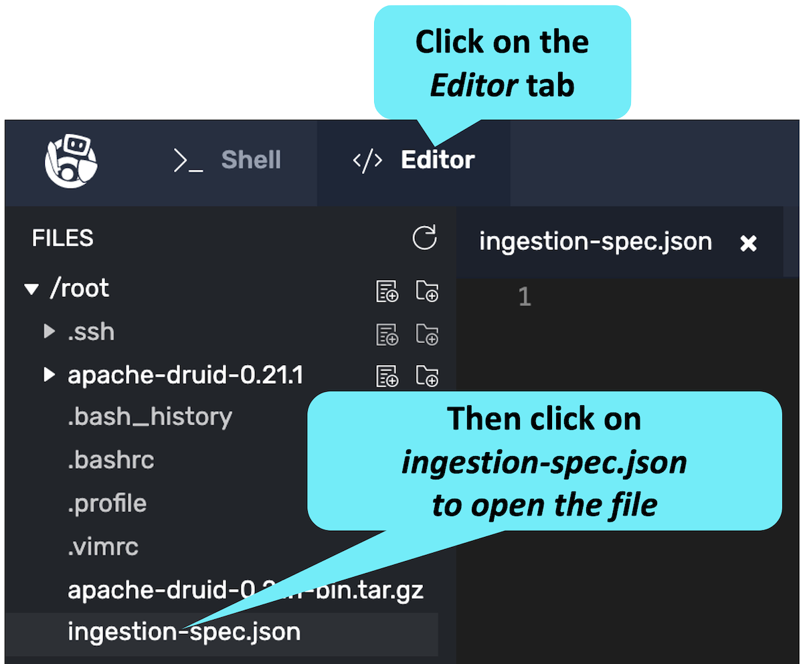
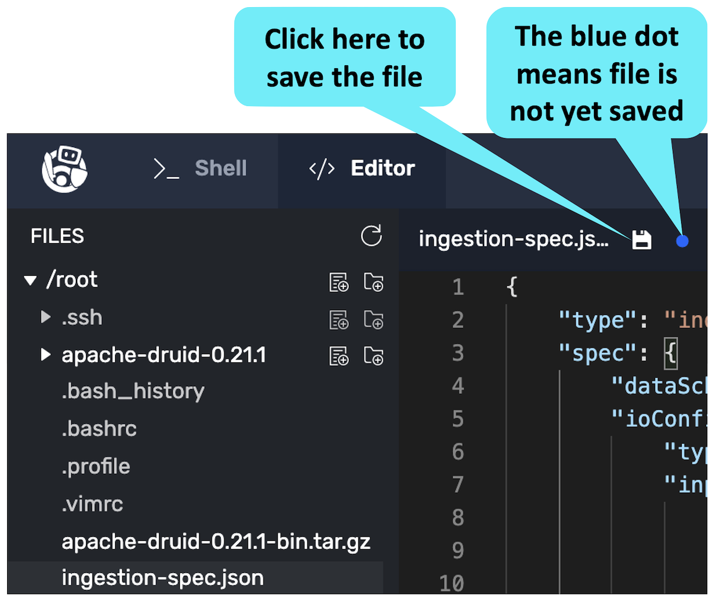

<details>
  <summary style="color:cyan"><b>Are you new to these exercises? Click here for instructions.</b></summary>
<hr style="color:cyan">
These exercises allow you to actually <i>do</i> the tasks involved in learning Druid within the comfort of your browser!<br><br>
Click on the command boxes to copy the commands to your clipboard.
Then, paste the commands in the terminal to execute them.<br><br>
Some of the steps of the exercise will require using browser tabs external to the exercise tab.
When necessary, the exercise will explain how to open these external tabs.
When working in other browser tabs, you will want to switch back and forth between the tabs.<br><br>
That's all there is to it! Enjoy!
<hr style="color:cyan">
</details>

The first step in data modeling is to learn about Druid's ingestion spec.
The ingestion spec is a JSON file that tells Druid what to do during each of the ingestion phases.


<a href="#img-1">
  
</a>

<a href="#" class="lightbox" id="img-1">
  
</a>


<h2 style="color:cyan">Step 1</h2><hr style="color:cyan;background-color:cyan;height:5px">

Open the (empty) ingestion spec in the editor.

<a href="#img-2">
  
</a>

<a href="#" class="lightbox" id="img-2">
  
</a>


<p><span style="color:cyan"><strong><em>NOTE: </em></strong></span> <i>You could also use the Druid Console to create the ingestion spec as we did in the <a href="https://learn.imply.io/apache-druid-basics" target="_blank">Druid Basics Course</a>.
But for this lab, we are going to build the ingestion spec manually in the editor.</i></p>

<h2 style="color:cyan">Step 2</h2><hr style="color:cyan;background-color:cyan;height:5px">

The ingestion spec is a JSON file containing two root-level properties: _type_ and _spec_.
In the editor, create the top level outline of the ingestion spec with a _type_ property (with a value of "???") and an empty _spec_ object.
Here are the [docs](https://druid.apache.org/docs/latest/ingestion/ingestion-spec.html) for the ingestion spec.

<details>
  <summary style="color:cyan"><b>Need more help?</b></summary>
<hr style="color:cyan">
You want the outline of ingestion spec to look like this:
<pre><code>{
    "type": "???",
    "spec": {
    }
}
</code></pre>
<hr style="color:cyan">
</details>


<h2 style="color:cyan">Step 3</h2><hr style="color:cyan;background-color:cyan;height:5px">

Fill in the type of ingestion.

<details>
  <summary style="color:cyan"><b>What is the ingestion type?</b></summary>
  <hr style="color:cyan">
  There are two main categories of Druid ingestion: batch and streaming.<br>
  Batch ingestion is a one-time process that imports data from a local or remote file.
  Streaming is a continually running process that imports data from a Kafka or Kinesis system.<br>
  The <i>type</i> property specifies which of these ingestion types to use.
  <hr style="color:cyan">
</details>


Replace the value of the _type_ property with the correct value for batch ingestion from the local file system.
You can find valid _type_ values in the [documentation for the ingestion spec](https://druid.apache.org/docs/latest/ingestion/tasks.html#all-task-types).

<details>
  <summary style="color:cyan"><b>What are the possible values for the <i>type</i> property?</b></summary>
<hr style="color:cyan">
Valid values include:
<ul>
  <li><i>index_parallel</i> - batch ingestion using a local or remote files</li>
  <li><i>index_hadoop</i> - batch ingestion using a Hadoop source</li>
  <li><i>index</i> - single-threaded batch ingestion using local or remote files (not recommended)</li>
  <li><i>kafka</i> - streaming ingestion from a Kafka service</li>
  <li><i>kinesis</i> - streaming ingestion from an AWS Kinesis service</li>
</ul>
<hr style="color:cyan">
</details>

<br>
<details>
  <summary style="color:cyan"><b>Need more help?</b></summary>
<hr style="color:cyan">
The outline of ingestion spec should now look like this:
<pre><code>{
    "type": "index_parallel",
    "spec": {
    }
}
</code></pre>
<hr style="color:cyan">
</details>

<h2 style="color:cyan">Step 4</h2><hr style="color:cyan;background-color:cyan;height:5px">

Fill in the _spec_ property with its three children.
Specify each child as an object with no properties (i.e., {}).

For example, the _ioConfig_ child looks like this:

```
"ioConfig": {}
```

You can read about the three properties of _spec_ [here](https://druid.apache.org/docs/latest/ingestion/ingestion-spec.html).

<details>
  <summary style="color:cyan"><b>Briefly, what are the three child properties of the <i>spec</i> object?</b></summary>
<hr style="color:cyan">
The three child properties are:
<ul>
  <li><i>dataSchema</i> - defines the resulting table data source schema</li>
  <li><i>ioConfig</i> - defines the input to the ingestion</li>
  <li><i>tuningConfig</i> - sepcifies various segment layout parameters</li>
</ul>
<hr style="color:cyan">
</details>

<p><span style="color:cyan"><strong><em>NOTE: </em></strong></span> <i>In JSON, multiple properties are comma separated.</i></p>

<details>
  <summary style="color:cyan"><b>Need more help?</b></summary>
<hr style="color:cyan">
The outline of ingestion spec should now look like this:
<pre><code>{
    "type": "index_parallel",
    "spec": {
        "dataSchema": {},
        "ioConfig": {},
        "tuningConfig": {}
    }
}
</code></pre>
<hr style="color:cyan">
</details>


<h2 style="color:cyan">Step 5</h2><hr style="color:cyan;background-color:cyan;height:5px">

Save the file.

<a href="#img-3">
  
</a>

<a href="#" class="lightbox" id="img-3">
  
</a>

<p><span style="color:cyan"><strong><em>NOTE: </em></strong></span>
<i>When you click the Check button in the bottom-right corner, we will verify the contents of the ingestion spec.
If your file is not correct, you can always click the Skip link next to the Check button to fix the contents of the file and move to the next step.
</i></p>

<h2 style="color:cyan">Outstanding! We have the ingestion spec skeleton in place!</h2>

<style type="text/css" rel="stylesheet">
.lightbox { display: none; position: fixed; justify-content: center; align-items: center; z-index: 999; top: 0; left: 0; right: 0; bottom: 0; padding: 1rem; background: rgba(0, 0, 0, 0.8); }
.lightbox:target { display: flex; }
.lightbox img { max-height: 100% }
.thumbnail:hover {
    position:fixed;
    top:-25px;
    left:-35px;
    width:500px;
    height:auto;
    display:block;
    z-index:999;
}
</style>
