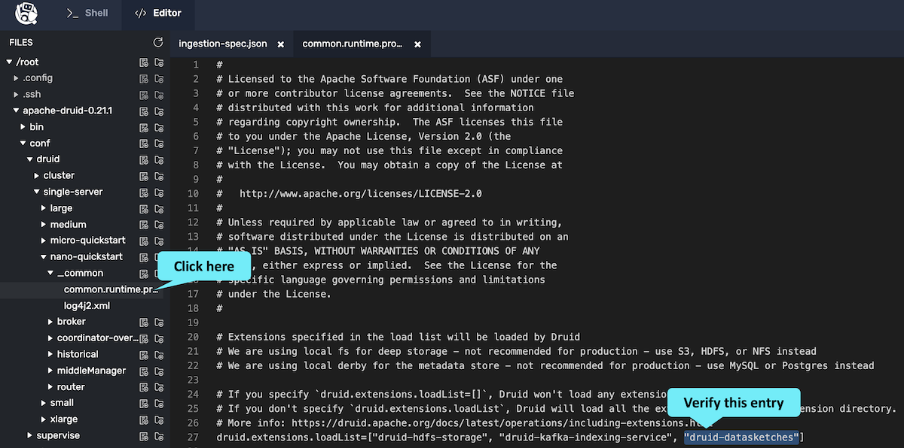

In this challenge, we will use a Quantile sketch during ingestion to improve scaling.
A good application for quantile sketches is when you have streaming data and you don't want to store all the raw data.


In this exercise, we will use a Bash shell script to generate the data like we have done in previous exercises, but this time the script will run continuously in the background.


We'll also set up a Kafka system that will route events to Druid, and a Kafka broker that consumes the events from Kafka and ingests them into a Druid table data source named _druid-processes_.

<h2 style="color:cyan">Step 1</h2><hr style="color:cyan;background-color:cyan;height:5px">

Let's run the Kafka broker in the background.

```
/root/kafka_2.13-2.7.0/bin/kafka-server-start.sh /root/kafka_2.13-2.7.0/config/server.properties > /dev/null &
```

Now, tell Kafka to create a topic named _druid-processes_.

<details>
  <summary style="color:cyan"><b>What is a Kafka topic?</b></summary>
<hr style="color:cyan">
Kafka is a stream processing system that allows data providers to stream data to consumer processes.
Providers stream data to topics, and consumers subscribe to topics to receive data.
Think of a topic as a stream-like version of a database table.<br>
<hr style="color:cyan">
</details>

<h2 style="color:cyan">Step 2</h2><hr style="color:cyan;background-color:cyan;height:5px">

Create the topic.

```
/root/kafka_2.13-2.7.0/bin/kafka-topics.sh \
  --create \
  --topic druid-processes \
  --bootstrap-server localhost:9092
```

<h2 style="color:cyan">Step 3</h2><hr style="color:cyan;background-color:cyan;height:5px">

Set the following Kafka environment variable.

```
export KAFKA_OPTS="-Dfile.encoding=UTF-8"
```

<h2 style="color:cyan">Step 4</h2><hr style="color:cyan;background-color:cyan;height:5px">

Start the producer, and pipe the results into Kafka.

```
/root/process-monitor-producer.sh | \
  /root/kafka_2.13-2.7.0/bin/kafka-console-producer.sh \
    --broker-list localhost:9092 \
    --topic druid-processes \
    > /dev/null &
```


Now, let's modify the ingestion spec to use the sketch.

<h2 style="color:cyan">Step 5</h2><hr style="color:cyan;background-color:cyan;height:5px">

Switch to the editor tab.

<a href="#img-1">
  
</a>

<a href="#" class="lightbox" id="img-1">
  
</a>

<h2 style="color:cyan">Step 6</h2><hr style="color:cyan;background-color:cyan;height:5px">

Open the ingestion spec file.

<a href="#img-2">
  
</a>

<a href="#" class="lightbox" id="img-2">
  
</a>

<h2 style="color:cyan">Step 7</h2><hr style="color:cyan;background-color:cyan;height:5px">

We want to create a metric column named <i>memory_sketch</i> that summarizes memory usage from the memory field.
If you want to figure this out for yourself, you may want to review the [docs](https://druid.apache.org/docs/latest/development/extensions-core/datasketches-quantiles.html).

<details>
  <summary style="color:cyan"><b>Need some help?</b></summary>
<hr style="color:cyan">
Add the following code to the <i>metricsSpec</i> and don't forget the comma to separates entries.
<pre><code>{
  "type" : "quantilesDoublesSketch",
  "name" : "memory_sketch",
  "fieldName" : "memory"
}</code></pre>
<hr style="color:cyan">
</details>

<h2 style="color:cyan">Step 8</h2><hr style="color:cyan;background-color:cyan;height:5px">

Save the file by clicking the _save_ icon.

<a href="#img-3">
  
</a>

<a href="#" class="lightbox" id="img-3">
  
</a>

<h2 style="color:cyan">Step 9</h2><hr style="color:cyan;background-color:cyan;height:5px">

We need to enable sketches as an extension to Druid in the common runtime properties file.

Open the file: <i>/root/apache-druid-0.21.1/conf/druid/cluster/_common/common.runtime.properties</i>.
Verify that _druid-datasketches_ is included in the list of extension (near or at line 27).

<a href="#img-4">
  
</a>

<a href="#" class="lightbox" id="img-4">
  
</a>

<h2 style="color:cyan">Step 10</h2><hr style="color:cyan;background-color:cyan;height:5px">

Switch back to the Shell tab.

<a href="#img-5">
  
</a>

<a href="#" class="lightbox" id="img-5">
  
</a>

<h2 style="color:cyan">Step 11</h2><hr style="color:cyan;background-color:cyan;height:5px">

Start the Druid ingestion.


```
curl -XPOST \
  -H'Content-Type: application/json' \
  -d @/root/ingestion-spec.json   \
  http://localhost:8081/druid/indexer/v1/supervisor \
  | jq
```

<p><span style="color:cyan"><strong><em>NOTE: </em></strong></span><i>If the ingestion fails, you can use the editor to review the log files in the folder here: /root/apache-druid-0.21.1/var/druid/indexing-logs/.
</i></p>

<h2 style="color:cyan">Step 12</h2><hr style="color:cyan;background-color:cyan;height:5px">

We want to perform a query to find the fiftieth percentile for the memory usage.

<details>
  <summary style="color:cyan"><b>What is a percentile?</b></summary>
<hr style="color:cyan">A percentile is the value within a range of observations such that the specified percentage of the observations fall below the value.
For example, if the ninetieth percentile of memory usage is 2.5, then 90% of the observations are 2.5 or less and 10% of the observations are more.<br>
<hr style="color:cyan">
</details>


Let's look at this query.

```
cat /root/query.json
```

Notice the use of the <i>APPROX_QUANTILE_DS</i> in the query.
Remember, since we created a sketch during ingestion, we need to use a corresponding sketch during query.

<h2 style="color:cyan">Step 13</h2><hr style="color:cyan;background-color:cyan;height:5px">


Now, run the query.

```
curl -s -X 'POST' \
  -H 'Content-Type:application/json' \
  -d @/root/query.json http://localhost:8888/druid/v2/sql
```

The results shows the approximate fiftieth percentile for memory usage.

If you want to experiment, you can open the query in the editor and change the _.5_ to whatever percentile you desire (between zero and one).
Then, rerun the command to perform the query.

<p><span style="color:cyan"><strong><em>NOTE: </em></strong></span><i>Unlike the previous exercises, the data you will be querying is streaming and therefore changing.
So, you may see different results for the same repeated query.
</i></p>

<h2 style="color:cyan">Excellent! You see that DataSketches are a tool for attacking large data concerns!</h2>

<style type="text/css" rel="stylesheet">
.lightbox { display: none; position: fixed; justify-content: center; align-items: center; z-index: 999; top: 0; left: 0; right: 0; bottom: 0; padding: 1rem; background: rgba(0, 0, 0, 0.8); }
.lightbox:target { display: flex; }
.lightbox img { max-height: 100% }
.thumbnail:hover {
    position:fixed;
    top:-25px;
    left:-35px;
    width:500px;
    height:auto;
    display:block;
    z-index:999;
}
</style>
