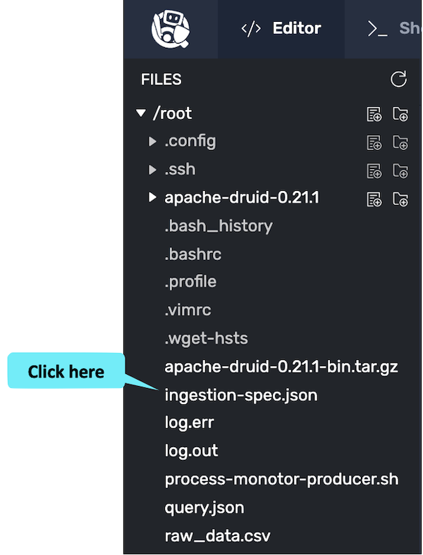

In this exercise, we learn to ingest timestamps.
Druid ingests timestamps early in the ingestion process.

<a href="#img-1">
  
</a>

<a href="#" class="lightbox" id="img-1">
  
</a>

<details>
  <summary style="color:cyan"><b>Are you new to these exercises? Click here for instructions.</b></summary>
<hr style="color:cyan">
These exercises allow you to actually <i>do</i> the tasks involved in learning Druid within the comfort of your browser!<br><br>
Click on the command boxes to copy the commands to your clipboard.
Then, paste the commands in the terminal to execute them.<br><br>
Some of the steps of the exercise will require using browser tabs external to the exercise tab.
When necessary, the exercise will explain how to open these external tabs.
When working in other browser tabs, you will want to switch back and forth between the tabs.<br><br>
That's all there is to it! Enjoy!
<hr style="color:cyan">
</details>


<details>
  <summary style="color:cyan"><b>What is all the fuss about Druid timestamps?</b></summary>
<hr style="color:cyan">
In Druid, timestamps are the primary organizing values for the data.
Virtually all Druid queries require a timestamp specification in the <i>WHERE</i> clause, so it's important to think carefully about what the timestamps look like.
The ingestion spec allows us to:
<ul>
  <li>Identify the column in the raw data that contains the timestamp</li>
  <li>Specify the format of the raw data timestamp</li>
  <li>Set the granularity of the timestamp allowing Druid to aggregate rows</li>
</ul>
Note that these ingestion spec capabilities allow us to apply several ingestion principles:
<ul>
  <li>Principle 1 - possibly denormalize raw data to "Create each table datasource for a specific set of query shapes"</li>
  <li>Principle 2 - put the timestamp into a known format to "Transform data, as much as possible, before storage"</li>
  <li>Principle 5 - choose appropriate query granularity to “Combine rows using query time granularity, approximation and rollup”</li>
</ul>
Remember, following these principles, we can create lean tables that are scalable and provide fast access.
<hr style="color:cyan">
</details>


<h2 style="color:cyan">Step 1</h2><hr style="color:cyan;background-color:cyan;height:5px">

Let's create some raw data that we can ingest.

We have created a Bash script that monitors the Druid processes and emits process CPU and memory utilization (feel free to open the script in the editor and peruse it if you like).
Run the following command to generate the data. This script will take 10+ seconds to run.

```
/root/process-monitor-producer.sh ISO 100 > /root/raw_data.csv
```

<h2 style="color:cyan">Step 2</h2><hr style="color:cyan;background-color:cyan;height:5px">

Let's inspect the data we just created using the following command.

```
head -10 /root/raw_data.csv
```

Observe the following about the data:
<ul>
  <li>The data has a comma-separated values (CSV) format
  <li>There is a header line with each of the column names</li>
  <li>The time column is an ISO formatted time column with millisecond granularity</li>
  <li>The second column is the process ID</li>
  <li>The third column is the process name</li>
  <li>The last two columns are the CPU and memory utilization</li>
</ul>

<h2 style="color:cyan">Step 3</h2><hr style="color:cyan;background-color:cyan;height:5px">

Switch to the editor tab.

<a href="#img-2">
  
</a>

<a href="#" class="lightbox" id="img-2">
  
</a>

<h2 style="color:cyan">Step 4</h2><hr style="color:cyan;background-color:cyan;height:5px">

Open the ingestion spec file.

<a href="#img-3">
  
</a>

<a href="#" class="lightbox" id="img-3">
  
</a>

When you open the ingestion spec, you will see a partial spec that we have created for you as a starting point.

<h2 style="color:cyan">Step 5</h2><hr style="color:cyan;background-color:cyan;height:5px">

Within the _dataSchema.timestampSpec_ property, add a _column_ property to specify the name of the raw data column containing the timestamp (you may want to refer back to the results from the previous _head_ command in the terminal to find the name of the timestamp column).
For more help, check out the timestamp section of the [docs](https://druid.apache.org/docs/latest/ingestion/ingestion-spec.html#timestampspec).


<details>
  <summary style="color:cyan"><b>Need more help?</b></summary>
<hr style="color:cyan">
You want the <i>timestampSpec</i> to look like this:
<pre><code>"timestampSpec": {
    "column": "time"
},
</code></pre>
<hr style="color:cyan">
</details>

<h2 style="color:cyan">Step 6</h2><hr style="color:cyan;background-color:cyan;height:5px">

Again, within the _dataSchema.timestampSpec_ property, specify the _format_ of the raw timestamp (hint: it's ISO)
For more help, check out the timestamp section of the [docs](https://druid.apache.org/docs/latest/ingestion/ingestion-spec.html#timestampspec).

<details>
  <summary style="color:cyan"><b>Need more help?</b></summary>
<hr style="color:cyan">
You want the <i>timestampSpec</i> to look like this (don't forget the comma at the end of the <i>column</i> property line):
<pre><code>"timestampSpec": {
    "column": "time",
    "format": "iso"
},
</code></pre>
<hr style="color:cyan">
</details>

<h2 style="color:cyan">Step 7</h2><hr style="color:cyan;background-color:cyan;height:5px">

Within the _granularitySpec_, set the query granularity to a second by replacing the three question marks (???).
For more help, check out the _granularitySpec_ section of the [docs](https://druid.apache.org/docs/latest/ingestion/ingestion-spec.html#granularityspec).

<details>
  <summary style="color:cyan"><b>Need more help?</b></summary>
<hr style="color:cyan">
Locate the <i>dataSchema.granularitySpec.queryGranularity</i> property and replace the question marks with the granularity (i.e., <i>second</i>) so that the <i>granularitySpec</i> looks like this.
<pre><code>"granularitySpec": {
    "segmentGranularity": "day",
    "queryGranularity": "second",
    "rollup": true
}
</code></pre>
<hr style="color:cyan">
</details>

<p><span style="color:cyan"><strong><em>NOTE: </em></strong></span> <i>We discuss modifying the granularitySpec here because it relates to timestamp values.
However, Duid processes the granularitySpec, and specifically the queryGranularity, much later than the timestampSpec processing.
</i></p>

<h2 style="color:cyan">Step 8</h2><hr style="color:cyan;background-color:cyan;height:5px">

Save the file by clicking the _save_ icon.

<a href="#img-5">
  
</a>

<a href="#" class="lightbox" id="img-5">
  
</a>

<h2 style="color:cyan">Step 9</h2><hr style="color:cyan;background-color:cyan;height:5px">

Your ingestion spec is now complete, so switch back to the Shell tab.

<a href="#img-6">
  
</a>

<a href="#" class="lightbox" id="img-6">
  
</a>

<h2 style="color:cyan">Step 10</h2><hr style="color:cyan;background-color:cyan;height:5px">

Use the following command to ingest the data.

```
/root/apache-druid-0.21.1/bin/post-index-task \
  --file /root/ingestion-spec.json \
  --url http://localhost:8081
```

<p><span style="color:cyan"><strong><em>NOTE: </em></strong></span><i>If the ingestion fails, you can use the editor to review the log files in the folder here: /root/apache-druid-0.21.1/var/druid/indexing-logs/.
</i></p>

<p><span style="color:cyan"><strong><em>NOTE: </em></strong></span> <i>This command sends a request to the Overlord API.
You can read more about it <a href="https://druid.apache.org/docs/latest/ingestion/tasks.html#task-api" target="_blank">here</a>.
</i></p>


<h2 style="color:cyan">Step 11</h2><hr style="color:cyan;background-color:cyan;height:5px">

Perform a query to see what the ingested data looks like.

```
curl -s -X 'POST' \
  -H 'Content-Type:application/json' \
  -d @/root/query.json http://localhost:8888/druid/v2/sql \
  | column -t -s,
```

<p><span style="color:cyan"><strong><em>NOTE: </em></strong></span> <i>This command sends a request to the Broker API.
You can read more about it <a href="https://druid.apache.org/docs/latest/tutorials/tutorial-query.html#query-sql-over-http" target="_blank">here</a>.
</i></p>

There are a few things we want to notice about the query results:
<ul>
  <li><b>Timestamp granularity</b> - the timestamps have been truncated to the second (remember the raw data had millisecond granularity).</li>
  <li><b>Rollup</b> - For each second, there is no more than one row per process. Recall that the raw data had roughly 10 rows per process per second.</li>
  <li><b>Aggregation</b> - Each row shows the average CPU and memory utilization for that second. We won't go into it now, but if you are interested, in the editor check out the <i>metricsSpec</i> section of the ingestion spec and <i>query.json</i>.</li>
</ul>


<h2 style="color:cyan">Great! We can ingest timestamps!</h2>

<style type="text/css" rel="stylesheet">
.lightbox { display: none; position: fixed; justify-content: center; align-items: center; z-index: 999; top: 0; left: 0; right: 0; bottom: 0; padding: 1rem; background: rgba(0, 0, 0, 0.8); }
.lightbox:target { display: flex; }
.lightbox img { max-height: 100% }
.thumbnail:hover {
    position:fixed;
    top:-25px;
    left:-35px;
    width:500px;
    height:auto;
    display:block;
    z-index:999;
}
</style>
