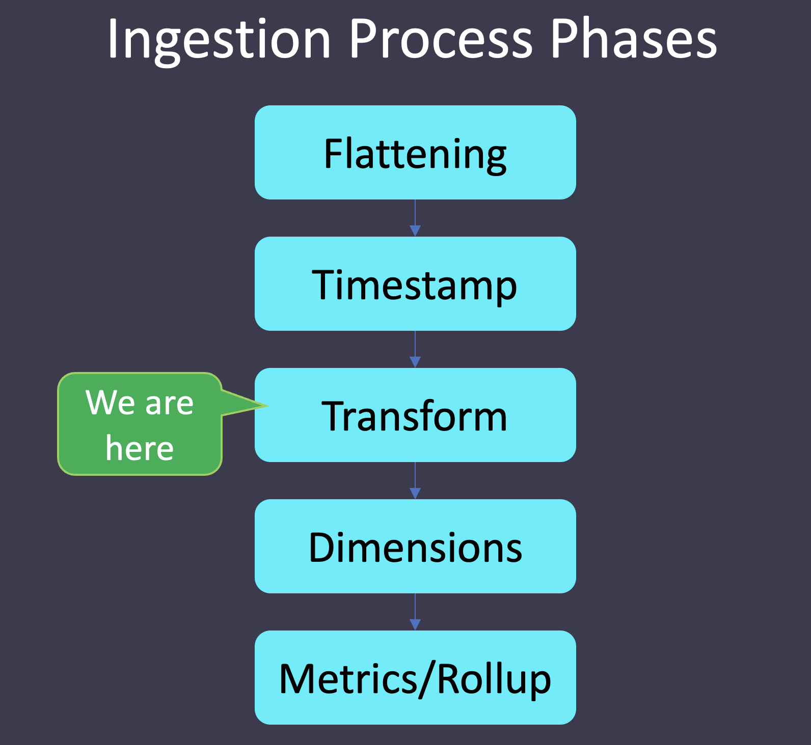

The _transformSpec_ allows us to modify the raw data prior to ingesting dimensions and metrics.

<a href="#img-1">
  
</a>

<a href="#" class="lightbox" id="img-1">
  
</a>

Let's see how we do that!

<details>
  <summary style="color:cyan"><b>Are you new to these exercises? Click here for instructions.</b></summary>
<hr style="color:cyan">
These exercises allow you to actually <i>do</i> the tasks involved in learning Druid within the comfort of your browser!<br><br>
Click on the command boxes to copy the commands to your clipboard.
Then, paste the commands in the terminal to execute them.<br><br>
Some of the steps of the exercise will require using browser tabs external to the exercise tab.
When necessary, the exercise will explain how to open these external tabs.
When working in other browser tabs, you will want to switch back and forth between the tabs.<br><br>
That's all there is to it! Enjoy!
<hr style="color:cyan">
</details>


<details>
  <summary style="color:cyan"><b>Why would I want to transform my data?</b></summary>
<hr style="color:cyan">
Sometimes the raw data format is not quite ideal.
We might be tempted just to ingest the raw data and solve any formatting problems during the queries.
<br><br>
Let's not make that mistake!
<br><br>
If we think about our queries, we can improve performance by doing the transform once during ingestion, instead of time and time again on each query.
<br><br>
Note that the <i>transforms</i> part of the <i>transformSpec</i> allows us to apply this ingestion principles:
<ul>
  <li>Principle 2: Transform data, as much as possible, before storage</li>
</ul>
Remember, following these ingestion principles, we can create lean tables that are scalable and provide fast access.
<hr style="color:cyan">
</details>

<h2 style="color:cyan">Step 1</h2><hr style="color:cyan;background-color:cyan;height:5px">

Let's create some raw data that we can ingest.

We have created a Bash script that monitors the Druid processes and emits process CPU and memory utilization (feel free to open the script in the editor and peruse it if you like).
Run the following command to generate the data. This script will take 10+ seconds to run.

```
/root/process-monitor-producer.sh ISO 100 \
  > /root/raw_data.csv
```

<h2 style="color:cyan">Step 2</h2><hr style="color:cyan;background-color:cyan;height:5px">

Let's inspect the data we just created using the following command.

```
head -10 /root/raw_data.csv
```

Observe the following about the data:
<ul>
  <li>The data has a comma-separated values (CSV) format
  <li>There is a header line with each of the column names</li>
  <li>The time column is an ISO formatted time column with millisecond granularity</li>
  <li>The second column is the process ID</li>
  <li>The third column is the process name</li>
  <li>The last two columns are the CPU and memory utilization</li>
</ul>

<h2 style="color:cyan">Step 3</h2><hr style="color:cyan;background-color:cyan;height:5px">

Let's transform the _processName_ field values to uppercase.


Switch to the editor tab.

<a href="#img-2">
  
</a>

<a href="#" class="lightbox" id="img-2">
  
</a>

<h2 style="color:cyan">Step 4</h2><hr style="color:cyan;background-color:cyan;height:5px">

Open the ingestion spec file.

<a href="#img-3">
  
</a>

<a href="#" class="lightbox" id="img-3">
  
</a>

<h2 style="color:cyan">Step 5</h2><hr style="color:cyan;background-color:cyan;height:5px">

Within the _dataSchema.transformSpec_ property, add an empty _transforms_ list (remember, objects use _{}_, but lists use _[]_).
For more help, check out the _transformSpec_ section of the [docs](https://druid.apache.org/docs/latest/ingestion/ingestion-spec.html#transformspec).


<details>
  <summary style="color:cyan"><b>Need more help?</b></summary>
<hr style="color:cyan">
You want the <i>transforms</i> list to look like this:
<pre><code>"transformSpec": {
  "transforms": [
  ]
},
</code></pre>
<hr style="color:cyan">
</details>

<h2 style="color:cyan">Step 6</h2><hr style="color:cyan;background-color:cyan;height:5px">

Now, let's add an element to the _transforms_ list that we just created.
The properties of this list element are:
<ul>
  <li><i>type</i> - the value for <i>type</i> is <i>expression</i></li>
  <li><i>name</i> - the value of this property is the name of the output field, which in this case is <i>upperProcessName</i></li>
  <li><i>expression</i> - the value of this property is the expression we use to convert the process name to uppercase, which is <i>upper(processName)</i></li>
</ul>

You can learn all about Druid expressions [here](https://druid.apache.org/docs/latest/misc/math-expr.html).

<details>
  <summary style="color:cyan"><b>Need more help?</b></summary>
<hr style="color:cyan">
You want the <i>transforms</i> list to look like this (don't forget the quotes and commas):
<pre><code>"transforms": [
  {
    "type": "expression",
    "name": "upperProcessName",
    "expression": "upper(processName)"
  }
]
</code></pre>
<hr style="color:cyan">
</details>

<p><span style="color:cyan"><strong><em>NOTE: </em></strong></span> <i>In order for the output field to show up in the table datasource, we have included an entry in the dimensionsSpec named "upperProcessName" in addition to the original "processName" dimension.
</i></p>

<h2 style="color:cyan">Step 7</h2><hr style="color:cyan;background-color:cyan;height:5px">

Save the file by clicking the _save_ icon.

<a href="#img-4">
  
</a>

<a href="#" class="lightbox" id="img-4">
  
</a>

<h2 style="color:cyan">Step 8</h2><hr style="color:cyan;background-color:cyan;height:5px">

Your ingestion spec is now ready, so switch back to the Shell tab.

<a href="#img-5">
  
</a>

<a href="#" class="lightbox" id="img-5">
  
</a>

<h2 style="color:cyan">Step 9</h2><hr style="color:cyan;background-color:cyan;height:5px">

Use the following command to ingest the data.

```
/root/apache-druid-0.21.1/bin/post-index-task \
  --file /root/ingestion-spec.json \
  --url http://localhost:8081
```

<p><span style="color:cyan"><strong><em>NOTE: </em></strong></span><i>If the ingestion fails, you can use the editor to review the log files in the folder here: /root/apache-druid-0.21.1/var/druid/indexing-logs/.
</i></p>

<h2 style="color:cyan">Step 10</h2><hr style="color:cyan;background-color:cyan;height:5px">

Perform a query to see what the ingested data looks like.

```
curl -s -X 'POST' \
  -H 'Content-Type:application/json' \
  -d @/root/query.json http://localhost:8888/druid/v2/sql \
  | column -t -s,
```

There are a couple of things we want to notice about the query results:
<ul>
  <li><b><i>processName</i></b> - the untransformed process name field.</li>
  <li><b><i>upperProcessName</i></b> - the transformed (uppercase) process name field.</li>
</ul>

<h2 style="color:cyan">Great! We can perform transforms!</h2>

<style type="text/css" rel="stylesheet">
.lightbox { display: none; position: fixed; justify-content: center; align-items: center; z-index: 999; top: 0; left: 0; right: 0; bottom: 0; padding: 1rem; background: rgba(0, 0, 0, 0.8); }
.lightbox:target { display: flex; }
.lightbox img { max-height: 100% }
.thumbnail:hover {
    position:fixed;
    top:-25px;
    left:-35px;
    width:500px;
    height:auto;
    display:block;
    z-index:999;
}
</style>
