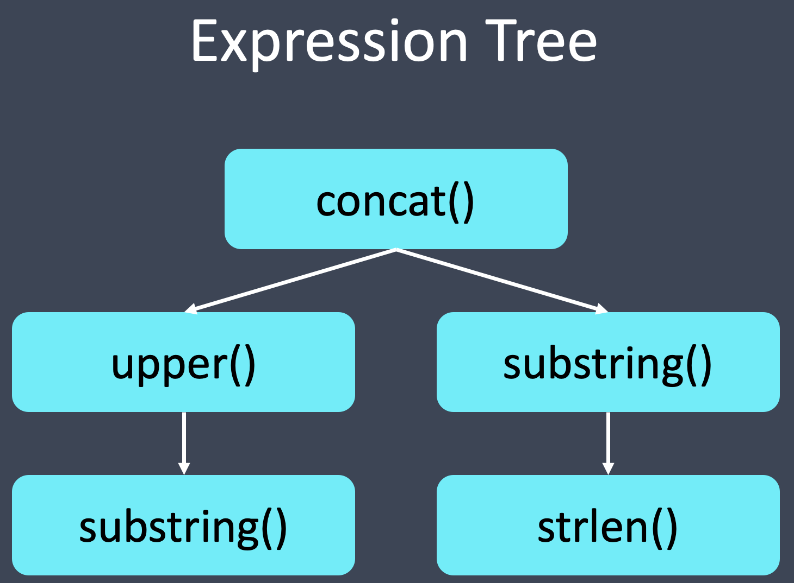

Here's another chance to practice transforming data.
Since we showed you how to do this in the last exercise, this exercise will be a bit less prescriptive.
This exercise will be a bit of a challenge, but we know you'll love it!


In this exercise, we will re-ingest the data that we created in the previous exercise, but we (meaning you) will change a few things.

Instead of an expression that converts the entire process name to uppercase, we want to only make the first letter of the process name uppercase.

<p><span style="color:cyan"><strong><em>NOTE: </em></strong></span><i>In the ingestion spec, notice that we have set appendToExisting to false so that we can replace the entire table datasource.
</i></p>

<h2 style="color:cyan">Step 1</h2><hr style="color:cyan;background-color:cyan;height:5px">

Open the ingestion spec in the editor and update the spec to make the change.

You will need to make the following adjustments:
<ul>
  <li>Change the expression to force only the first character of the process name to be uppercase, and leave the remainder of the process name unchanged</li>
  <li>Let's get rid of the untransformed process name column by removing its entry from the <i>dimensionsSpec</i></li>
</ul>

We will need to rely heavily on the [docs](https://druid.apache.org/docs/latest/misc/math-expr.html).
But here's a hint: you are going to want to use <i>strlen()</i>, <i>substring()</i>, <i>upper()</i>, and <i>concat()</i>.

<p><span style="color:cyan"><strong><em>NOTE: </em></strong></span><i>There are multiple ways to solve this challenge. We are coaching you towards a specific solution, but if you have a better way to achieve the same result, feel free to follow a different approach!
</i></p>


<details>
  <summary style="color:cyan"><b>Need more help?</b></summary>
<hr style="color:cyan">
Here's an expression tree that shows how the functions fit together.
<a href="#img-1">
  
</a>
<a href="#" class="lightbox" id="img-1">
  
</a>
The expression tree shows us that (working from the bottom of the tree) we do the following:
<ol>
  <li>Use <i>substring()</i> to peel off the first character of the name</li>
  <li>Feed the results of <i>substring()</i> into <i>upper()</i></li>
  <li>Feed the results of <i>upper()</i> as the first parameter to <i>concat()</i>
  <li>To build the second parameter to <i>concat()</i> use <i>strlen()</i> to determine how long the process name is</li>
  <li>Use the results of <i>strlen()</i> (minus 1) as the third parameter to <i>substring()</i></li>
</ol>
<hr style="color:cyan">
</details>

<br>
<details>
  <summary style="color:cyan"><b>Still need even more help?</b></summary>
<hr style="color:cyan">
The expression looks like this:
<pre><code>concat(upper(substring(processName,0,1)),substring(processName,1,strlen(processName)-1))</pre></code>
<hr style="color:cyan">
</details>

Be sure to save the file!

<h2 style="color:cyan">Step 2</h2><hr style="color:cyan;background-color:cyan;height:5px">

Back in the shell, ingest the data using the following command.

```
/root/apache-druid-0.21.1/bin/post-index-task \
  --file /root/ingestion-spec.json \
  --url http://localhost:8081
# now wait for new segments to load
until curl localhost:8888/druid/coordinator/v1/datasources/process-data/loadstatus?forceMetadataRefresh=true 2> /dev/null | \
  grep -q '"process-data":100'
  do
    sleep 1
  done
```

<details>
  <summary style="color:cyan"><b>What does the loop do after the ingest command?</b></summary>
<hr style="color:cyan">
The default Druid ingest script merely waits for segments to be available.
When we ingest new segments, the script does not distinguish between old segments and new ones.
This loop checks the status of the historical and waits for the new segments to load.
<hr style="color:cyan">
</details>


<h2 style="color:cyan">Step 3</h2><hr style="color:cyan;background-color:cyan;height:5px">

Query and review the data.

<p><span style="color:cyan"><strong><em>NOTE: </em></strong></span><i>When using the following command, it may take a minute for the changed data to load. If you see the all-upper names, wait a minute and try again.
</i></p>


```
curl -s -X 'POST' \
  -H 'Content-Type:application/json' \
  -d @/root/query.json http://localhost:8888/druid/v2/sql \
  | column -t -s,
```

You should see that the process names now begin with upper case letters.
You will also notice that the original process name column is gone.

<h2 style="color:cyan">Amazing! You have performed a sophisticated transform on the process name.</h2>


<style type="text/css" rel="stylesheet">
.lightbox { display: none; position: fixed; justify-content: center; align-items: center; z-index: 999; top: 0; left: 0; right: 0; bottom: 0; padding: 1rem; background: rgba(0, 0, 0, 0.8); }
.lightbox:target { display: flex; }
.lightbox img { max-height: 100% }
.thumbnail:hover {
    position:fixed;
    top:-25px;
    left:-35px;
    width:500px;
    height:auto;
    display:block;
    z-index:999;
}
</style>
