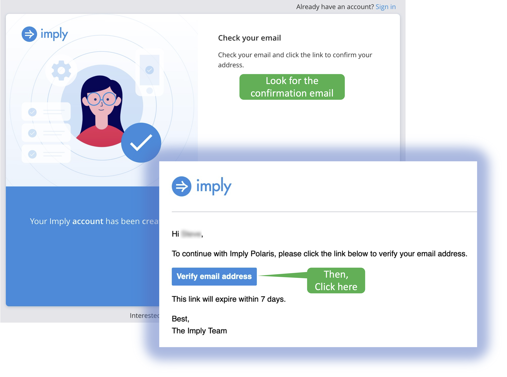

We'll help you get signed up for a free 60 day Polaris trail!
Follow the instructions as you use the form on the left.

  
<b>What is Polaris? Click here.</b>

Polaris is Imply's Apache Druid® SaaS offering.
When you use Polaris, you get all the benefits of Druid (lots of data, lots of concurrent users, and quick response time), with none of the system management hassles.
Imply's core competency is Druid, so you can be certain your Druid database is well tuned by experts!
Want to learn more?
Check out the documentation <a href="https://docs.imply.io/polaris" target="_blank">here</a>.

<h2 style="color:cyan">Step 1</h2>

Fill in the signup form.

<h2 style="color:cyan">Step 2</h2>

Create a password and identify your organization.

  
<b>What are Polaris organizations?</b>

In Polaris, organizations allow users to collaborate as well as share and manage tables.
If you are the first in your organization to set up a Polaris account, you will have administrative privileges so you can invite other users.
You will also be able to manage other users' privileges.
 
If you are not the first to signup for your organization, you will need to contact the organization's administrator and request an invite.

<h2 style="color:cyan">Step 3</h2>

Confirm your email address.

This will open a new browser tab.
Follow the rest of the instructions for this lab in the new browser tab.
You will need to switch between that tab and this one to follow the instructions.

<h2 style="color:cyan">Step 4</h2>

Sign in to Polaris.

<h2 style="color:cyan">Step 5</h2>

Wait for Polaris to finish creating your account.

<h2 style="color:cyan">Step 6</h2>

Once you see the _Create table_ button, you are all set!

Don't close the Polaris tab as you will use it in the next exercise.

<h2 style="color:cyan">Congratulations! You're ready to start using Polaris!</h2>

