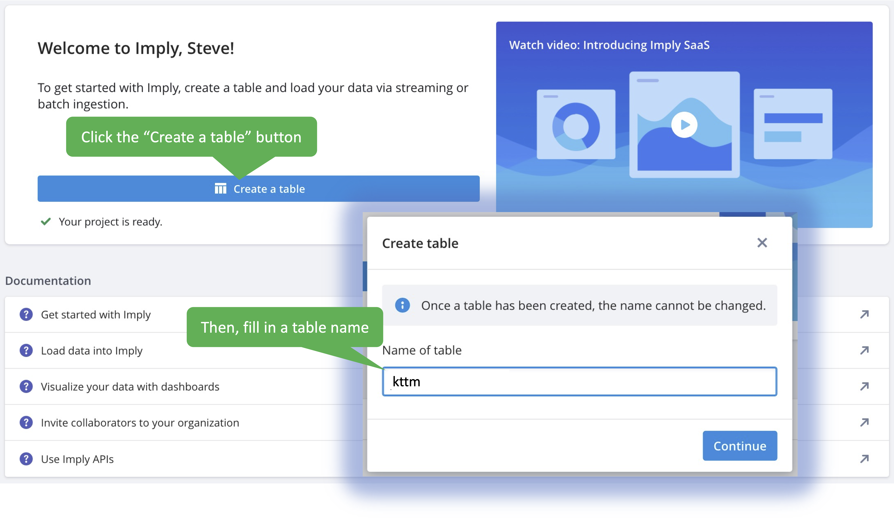
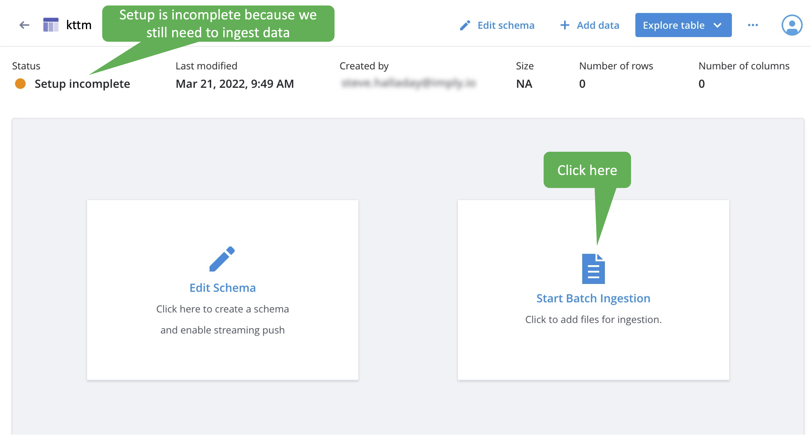
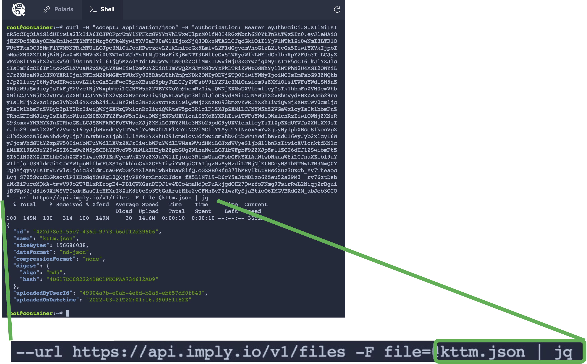
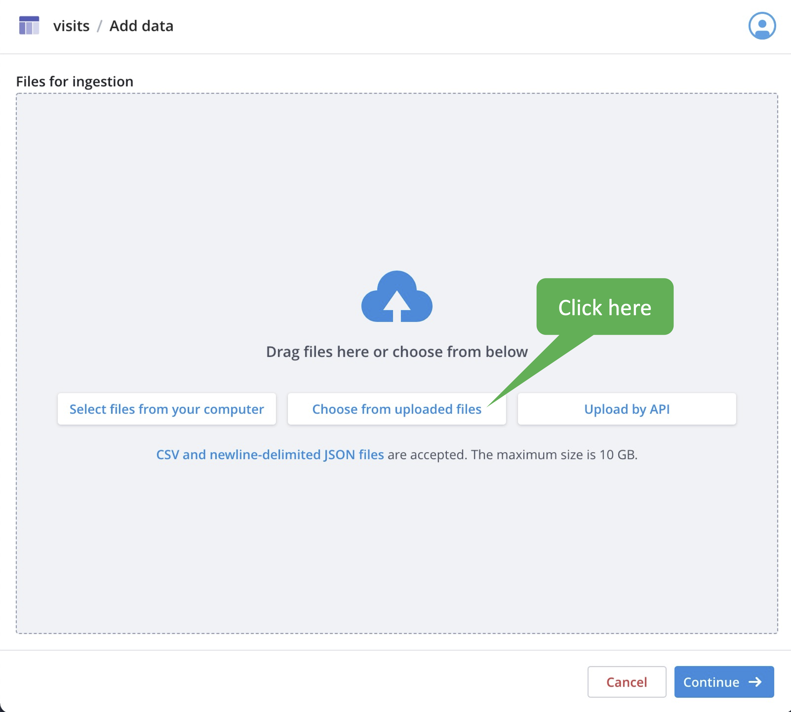
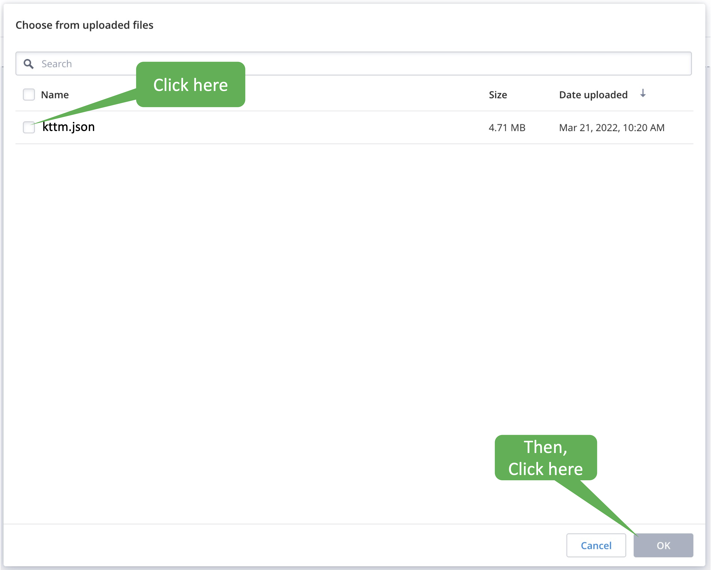
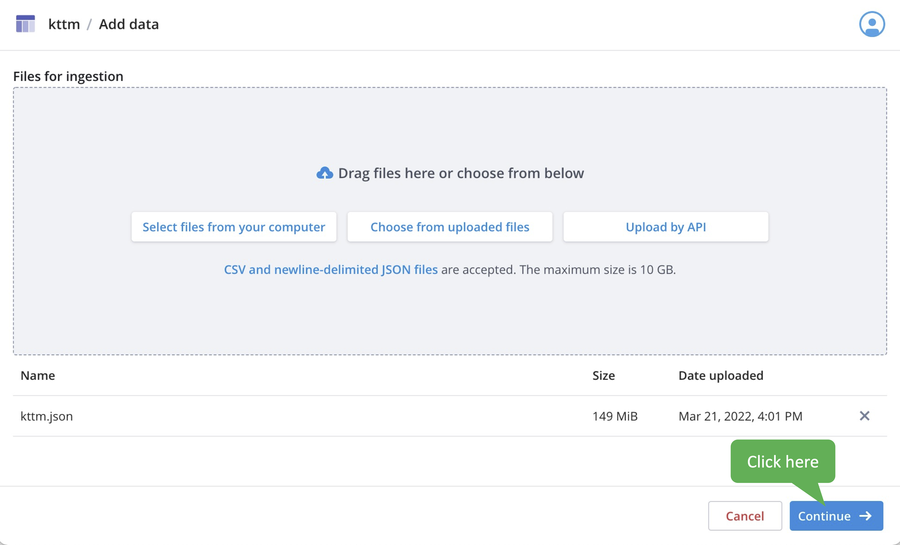
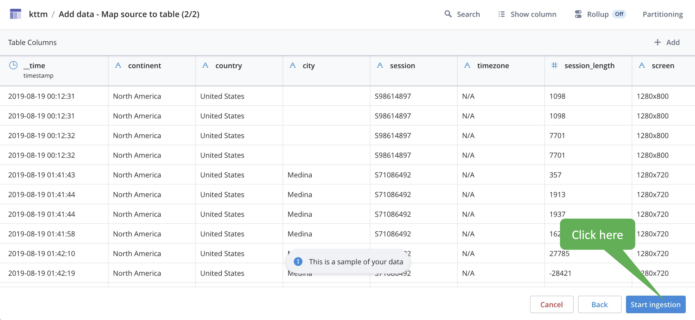
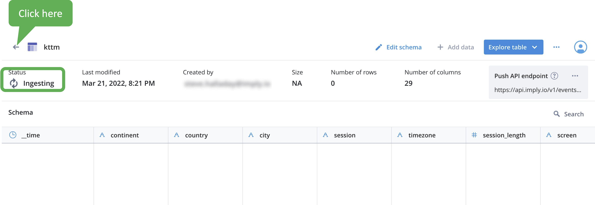
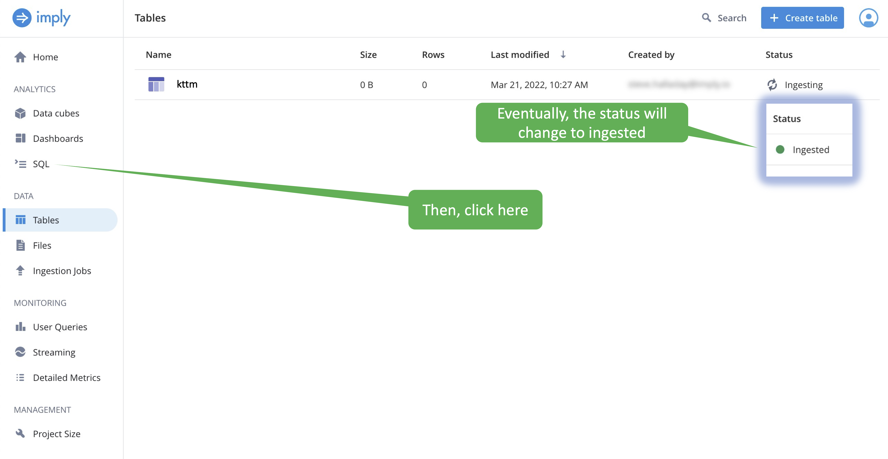
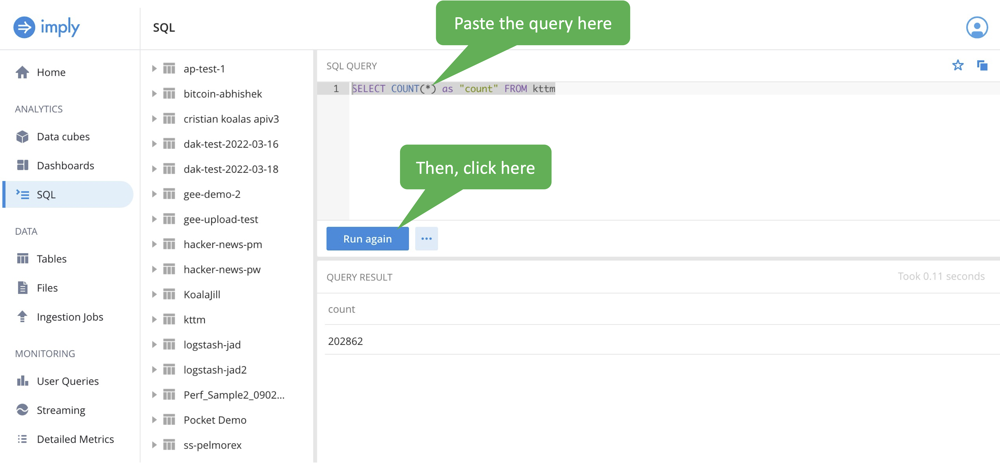

In this lab, we'll ingest the data we extracted in the first step.

<p><span style="color:cyan"><strong><em>NOTE: </em></strong></span> <i>You will need to continue using the Polaris tab you created in the previous lab. Switch between the Polaris tab and this tab as necessary to follow the instructions.</i></p>

<h2 style="color:cyan">Step 1</h2><hr style="color:cyan;background-color:cyan;height:5px">

We need to create a Polaris table named _kttm_.
Click the _Create a table_ button and fill in the table name.

<a href="#img-1">
  
</a>

<a href="#" class="lightbox" id="img-1">
  
</a>

<h2 style="color:cyan">Step 2</h2><hr style="color:cyan;background-color:cyan;height:5px">

Now the table exists, but contains no data.
Start an ingestion.

<a href="#img-2">
  
</a>

<a href="#" class="lightbox" id="img-2">
  
</a>

<h2 style="color:cyan">Step 3</h2><hr style="color:cyan;background-color:cyan;height:5px">

We'll use a _curl_ command to upload the data to Polaris.
Copy the _curl_ command as shown.

<a href="#img-3">
  
</a>

<a href="#" class="lightbox" id="img-3">
  
</a>

<h2 style="color:cyan">Step 6</h2><hr style="color:cyan;background-color:cyan;height:5px">

Paste the _curl_ command into the terminal.
DO NOT EXECUTE THE COMMAND YET!!!!!

<h2 style="color:cyan">Step 7</h2><hr style="color:cyan;background-color:cyan;height:5px">

At the end of the command, replace <i>YOUR_FILE.json</i> with the following and execute the command.

```
kttm.json | jq
```

<a href="#img-7">
  
</a>

<a href="#" class="lightbox" id="img-7">
  
</a>

<details>
  <summary style="color:cyan"><b>What is <i>jq</i>? Click here.</b></summary>
<hr style="color:cyan">
<i>jq</i> is a command you can use to format and query JSON.
In this case we pipe the output from the <i>curl</i> command to <i>jq</i> to make the output a little easier to read.
<hr style="color:cyan">
</details>

<h2 style="color:cyan">Step 8</h2><hr style="color:cyan;background-color:cyan;height:5px">

Click on the button to choose from uploaded files.

<a href="#img-8">
  
</a>

<a href="#" class="lightbox" id="img-8">
  
</a>

<h2 style="color:cyan">Step 9</h2><hr style="color:cyan;background-color:cyan;height:5px">

Select the uploaded file (this is the file we uploaded in Step 7).

<a href="#img-9">
  
</a>

<a href="#" class="lightbox" id="img-9">
  
</a>

<h2 style="color:cyan">Step 10</h2><hr style="color:cyan;background-color:cyan;height:5px">

Click the _Continue_ button.

<a href="#img-10">
  
</a>

<a href="#" class="lightbox" id="img-10">
  
</a>

<h2 style="color:cyan">Step 11</h2><hr style="color:cyan;background-color:cyan;height:5px">

Begin the actual ingestion by clicking the _Start ingestion_ button.

<a href="#img-11">
  
</a>

<a href="#" class="lightbox" id="img-11">
  
</a>

<h2 style="color:cyan">Step 12</h2><hr style="color:cyan;background-color:cyan;height:5px">

It will take some time for the ingestion to complete.
You can see the status as shown.

Click the left-arrow to go to the _Tables_ page.

<a href="#img-12">
  
</a>

<a href="#" class="lightbox" id="img-12">
  
</a>

<h2 style="color:cyan">Step 13</h2><hr style="color:cyan;background-color:cyan;height:5px">

Once the ingestion completes, the status changes from _Ingesting_ to _Ingested_ as shown.
When the ingestion is complete, click on the _SQL_ selection on the left.

<a href="#img-13">
  
</a>

<a href="#" class="lightbox" id="img-13">
  
</a>

<h2 style="color:cyan">Step 14</h2><hr style="color:cyan;background-color:cyan;height:5px">

Let's run a count query to demonstrate the data was ingested.
Copy the SQL query.

```
SELECT COUNT(*) as "count" FROM kttm
```

<h2 style="color:cyan">Step 15</h2><hr style="color:cyan;background-color:cyan;height:5px">

Paste the query and click the run button as shown.

<a href="#img-15">
  
</a>

<a href="#" class="lightbox" id="img-15">
  
</a>


You will see over 200,000 rows.


<h2 style="color:cyan">It's that easy! You've moved your data to Polaris!</h2>


<style type="text/css" rel="stylesheet">
.lightbox { display: none; position: fixed; justify-content: center; align-items: center; z-index: 999; top: 0; left: 0; right: 0; bottom: 0; padding: 1rem; background: rgba(0, 0, 0, 0.8); }
.lightbox:target { display: flex; }
.lightbox img { max-height: 100% }
.thumbnail:hover {
    position:fixed;
    top:-25px;
    left:-35px;
    width:500px;
    height:auto;
    display:block;
    z-index:999;
}
</style>
