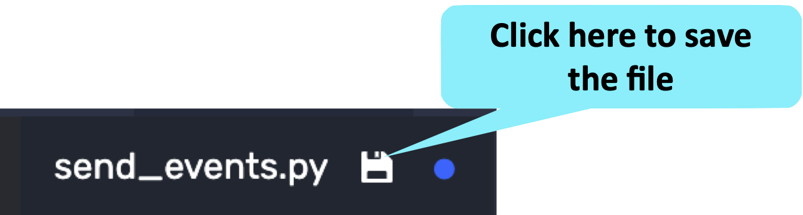

In the previous challenge, we ingested rows from an existing Druid table into a Polaris table.
This is a fine solution if all of your data is statically stored in Druid, but the more likely scenario is that you have an event source that is constantly filling your Druid table.


In this case, you will need to do the batch ingestions we learned about in the previous challenge, _and_ you will need to direct your event source directly to Polaris.


In this challenge we'll build a Python program that will stream events directly to Polaris.

<h2 style="color:cyan">Step 1</h2><hr style="color:cyan;background-color:cyan;height:5px">

Recall from the first challenge that we generate events with a script that monitors Druid processes.
Review the output of this script with the following command.

```
/root/process-monitor-producer.sh ISO JSON 3
```

<h2 style="color:cyan">Step 2</h2><hr style="color:cyan;background-color:cyan;height:5px">

Switch to the editor tab and open the empty file named <i>send_events.py</i>.
Open <i>/root/send_events.py</i> in editor

<a href="#img-3">
  
</a>
<a href="#" class="lightbox" id="img-3">
  
</a>

<h2 style="color:cyan">Step 3</h2><hr style="color:cyan;background-color:cyan;height:5px">

Copy the following code and paste it in the editor.

<details>
  <summary style="color:cyan"><b>What does this code do? Click here.</b></summary>
<hr style="color:cyan">
We could send every record to Polaris as soon as it is generated, but that might cause a lot of overhead that we can avoid with buffering.
This code demonstrates buffering by reading and buffering 10 records and then printing them out to the terminal.
<br>
You can ignore the comments for now - they are there to help us know where to paste the code in the next step.
<hr style="color:cyan">
</details>

```
import json
import os
import sys


# Start preamble code

# End preamble code

buffer = ''
line_count = 0
for line in sys.stdin:
  buffer += line
  line_count += 1
  if (line_count % 10) == 0:
    print(buffer)
    # Start send events code

    # End send events code

    buffer = ''
```

<h2 style="color:cyan">Step 4</h2><hr style="color:cyan;background-color:cyan;height:5px">

Save the file.

<a href="#img-4">
  
</a>
<a href="#" class="lightbox" id="img-4">
  
</a>

<h2 style="color:cyan">Step 5</h2><hr style="color:cyan;background-color:cyan;height:5px">

Switch back to the _Shell_ tab.

<a href="#img-5">
  
</a>
<a href="#" class="lightbox" id="img-5">
  
</a>


<h2 style="color:cyan">Step 6</h2><hr style="color:cyan;background-color:cyan;height:5px">

Try out the program to see how it works.

<details>
  <summary style="color:cyan"><b>What does this command do? Click here.</b></summary>
<hr style="color:cyan">
This command runs the Druid process monitor to generate 10 event samples.
The command then pipes these event samples into the Python program.
<hr style="color:cyan">
</details>

```
/root/process-monitor-producer.sh ISO JSON 10 | python3 /root/send_events.py
```

<h2 style="color:cyan">Step 7</h2><hr style="color:cyan;background-color:cyan;height:5px">

Switch back to the editor

<a href="#img-5">
  
</a>
<a href="#" class="lightbox" id="img-5">
  
</a>

<h2 style="color:cyan">Step 8</h2><hr style="color:cyan;background-color:cyan;height:5px">

Add in the following preamble code between the first set of comments.

<details>
  <summary style="color:cyan"><b>What does this code do? Click here.</b></summary>
<hr style="color:cyan">
This code performs some one-time intial processing including:
<ul>
<li>Importing the <i>requests</i> library, which is necessary for sending events using http</li>
<li>Does a sanity check of the commandline arguments</li>
<li>Sets up the URL we will use to send events to Polaris</li>
<li>Creates the headers we will use for sending events to Polaris</li>
</ul>
<hr style="color:cyan">
</details>

```
import requests

if len(sys.argv) != 3:
  print('Usage: Python3 '+sys.argv[0]+' TABLE_ID TOKEN')
  exit(-1)

url = "https://api.imply.io/v1/events/"+os.getenv('TABLE_ID')

headers = {
  'Authorization': 'Bearer {token}'.format(token=os.getenv('IMPLY_TOKEN')),
  'Content-Type': 'application/json'
}
```

<h2 style="color:cyan">Step 9</h2><hr style="color:cyan;background-color:cyan;height:5px">

Add this code to send events to Polaris between the second set of comments.

<details>
  <summary style="color:cyan"><b>What does this code do? Click here.</b></summary>
<hr style="color:cyan">
This code sends the events to Polaris and prints the response.
<hr style="color:cyan">
</details>

```
    response = requests.request("POST", url, headers=headers, data=buffer)
    print(response)
```

<h2 style="color:cyan">Step 10</h2><hr style="color:cyan;background-color:cyan;height:5px">

Save the file.

<a href="#img-11">
  
</a>
<a href="#" class="lightbox" id="img-11">
  
</a>

<h2 style="color:cyan">Step 11</h2><hr style="color:cyan;background-color:cyan;height:5px">

Switch back to the _Shell_ tab.

<a href="#img-12">
  
</a>
<a href="#" class="lightbox" id="img-12">
  
</a>

<h2 style="color:cyan">Step 12</h2><hr style="color:cyan;background-color:cyan;height:5px">

Use the following command to generate and send events to Polaris.
This command works like the previous command except events will continue to stream for about 5 minutes.
We'll run this command in the background.

```
/root/process-monitor-producer.sh ISO JSON 600 | python3 /root/send_events.py $TABLE_ID $IMPLY_TOKEN > /dev/null &
```

<h2 style="color:cyan">Step 13</h2><hr style="color:cyan;background-color:cyan;height:5px">

Use the following command to query the number of rows in the table.

```
curl --location --request POST "https://api.imply.io/v1/projects/$PROJECT_ID/query/sql" \
  --header "Accept: application/json" \
  --header "Content-Type: application/json" \
  --header "Authorization: Bearer $IMPLY_TOKEN" \
  --data-raw "{ \"query\": \"SELECT COUNT(*) as \\\"count\\\" FROM \\\"$TABLE_NAME\\\"\" }" \
| jq
```

You can run this command several times and observe the number of rows increasing.

<h2 style="color:cyan">Congratulations! You have ingested streaming data into the Polaris table!</h2>


<style type="text/css" rel="stylesheet">
.lightbox { display: none; position: fixed; justify-content: center; align-items: center; z-index: 999; top: 0; left: 0; right: 0; bottom: 0; padding: 1rem; background: rgba(0, 0, 0, 0.8); }
.lightbox:target { display: flex; }
.lightbox img { max-height: 100% }
.thumbnail:hover {
    position:fixed;
    top:-25px;
    left:-35px;
    width:500px;
    height:auto;
    display:block;
    z-index:999;
}
</style>
