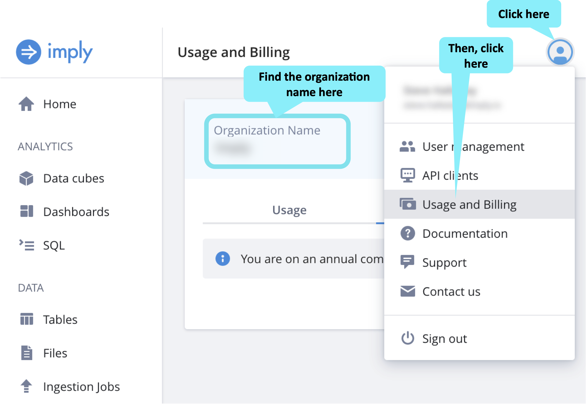
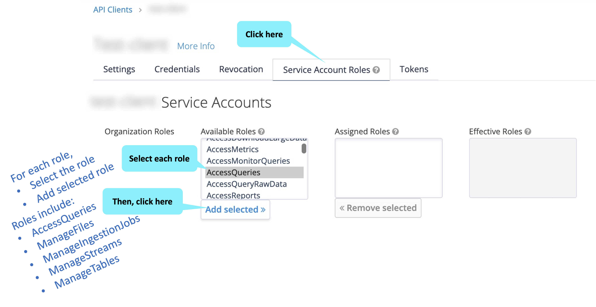

In this challenge we will set up some environment variables and use these to create a table and define its schema.

<h2 style="color:cyan">Step 1</h2><hr style="color:cyan;background-color:cyan;height:5px">

Save your organization's name in a variable by replacing _&lt;your org name goes here&gt;_ with your organization's name.
This is the name of the organization you used when you signed up for Polaris.

<details>
  <summary style="color:cyan"><b>Don't remember your organization name? Click here.</b></summary>
<hr style="color:cyan">
Click on the user icon in the top-right corner of the Polaris user interface.
Then, select <i>Usage and billing</i>.
<a href="#img-1">
  
</a>
<a href="#" class="lightbox" id="img-1">
  
</a>
<hr style="color:cyan">
</details>

```
export ORGANIZATION_NAME=<your org name goes here>
```

<h2 style="color:cyan">Step 2</h2><hr style="color:cyan;background-color:cyan;height:5px">

Create an API client.

<details>
  <summary style="color:cyan"><b>What is an API Client? Click here.</b></summary>
<hr style="color:cyan">
An API Client is the credentials we can use when accessing the Polaris APIs.
Learn more <a href="https://docs.imply.io/polaris/oauth/#create-a-custom-api-client" target="_blank">here</a>.
<hr style="color:cyan">
</details>

<a href="#img-2">
  
</a>

<a href="#" class="lightbox" id="img-2">
  
</a>

<h2 style="color:cyan">Step 3</h2><hr style="color:cyan;background-color:cyan;height:5px">

Save your API Client ID in a variable by replacing _&lt;your API client ID goes here&gt;_ with  the ID of the API Client you created in the previous step.

```
export CLIENT_ID=<your API client ID goes here>
```

<h2 style="color:cyan">Step 4</h2><hr style="color:cyan;background-color:cyan;height:5px">

Prepare to store the client secret in a variable by copying and pasting the following command into the shell.
DO NOT EXECUTE THIS COMMAND YET!!!

```
export CLIENT_SECRET=<your client secret goes here>
```

<h2 style="color:cyan">Step 5</h2><hr style="color:cyan;background-color:cyan;height:5px">

In the Polaris user interface, copy the client secret to the clipboard.
Then back in the shell, replace _&lt;your client secret goes here&gt;_ with the secret from the clipboard and execute the command.

<a href="#img-5">
  
</a>

<a href="#" class="lightbox" id="img-5">
  
</a>
<hr style="color:cyan">

<h2 style="color:cyan">Step 6</h2><hr style="color:cyan;background-color:cyan;height:5px">

The API Client needs the following roles to complete this exercise:
- AccessQueries
- ManageFiles
- ManageIngestionJobs
- ManageStreams
- ManageTables

Back in the Polaris user interface, add each of these roles to the API Client.

<a href="#img-6">
  
</a>

<a href="#" class="lightbox" id="img-6">
  
</a>

<h2 style="color:cyan">Step 7</h2><hr style="color:cyan;background-color:cyan;height:5px">

Retrieve your API access token by executing the following command.

<details>
  <summary style="color:cyan"><b>How does this command work? Click here.</b></summary>
<hr style="color:cyan">
Fundamentally, this command is a <i>curl</i> command that retrieves the access token.
Note that the <i>curl</i> command uses the organization name variable to construct the endpoint URL.
The parameters to the <i>curl</i> command include the API Client ID and API Client secret.
<br>
This command uses <i>jq</i> to fetch the token value from the resulting JSON.
Then, the command stores the token value in an environment variable.
Learn more <a href="https://docs.imply.io/polaris/oauth/#download-access-tokens" target="_blank">here</a>.
<hr style="color:cyan">
</details>

```
export IMPLY_TOKEN=$(curl --request POST "https://id.imply.io/auth/realms/$ORGANIZATION_NAME/protocol/openid-connect/token" \
  --header "Content-Type: application/x-www-form-urlencoded" \
  --data-urlencode "client_id=$CLIENT_ID" \
  --data-urlencode "client_secret=$CLIENT_SECRET" \
  --data-urlencode "grant_type=client_credentials" \
| jq -r .access_token)
```

<h2 style="color:cyan">Step 8</h2><hr style="color:cyan;background-color:cyan;height:5px">

Create an environment variable with a unique table name.

<details>
  <summary style="color:cyan"><b>Why do we want a unique table name? Click here.</b></summary>
<hr style="color:cyan">
You can name the table whatever you like, so feel free to set the value of the <i>TABLE_NAME</i> as you wish.
In this example, we add a small random number to the table name to prevent a table name collision.<br>
For example, imagine two people from the same organization working through this training and creating tables with the same names.
This name collision would be confusing, so we avoid it by slightly randomizing the table name.
<hr style="color:cyan">
</details>

```
export TABLE_NAME="process-data-$[$RANDOM % 100]"
echo $TABLE_NAME
```

<h2 style="color:cyan">Step 9</h2><hr style="color:cyan;background-color:cyan;height:5px">

Given the token, create the table using the following command.

<details>
  <summary style="color:cyan"><b>Want to know more about this command? Click here.</b></summary>
<hr style="color:cyan">
Again, we use a <i>curl POST</i> command.
We pass the token in a header, and we pass the name of the table in the JSON body.
Learn more <a href="https://docs.imply.io/polaris/api-create-table/" target="_blank">here</a>.
<hr style="color:cyan">
</details>

```
curl --location --request POST "https://api.imply.io/v1/tables" \
  --header "Authorization: Bearer $IMPLY_TOKEN" \
  --header "Content-Type: application/json" \
  --data-raw "{
    \"name\": \"$TABLE_NAME\"
  }" \
| jq
```

<h2 style="color:cyan">Step 10</h2><hr style="color:cyan;background-color:cyan;height:5px">

We can retrieve the table info with the following command.
Learn more [here](https://docs.imply.io/polaris/api-table-id).

```
curl --location --request GET "https://api.imply.io/v1/tables?name=$TABLE_NAME" \
  --header "Authorization: Bearer $IMPLY_TOKEN" \
| jq
```

<h2 style="color:cyan">Step 11</h2><hr style="color:cyan;background-color:cyan;height:5px">

Let's modify the previous command by using _jq_ to parse out the table ID, and then store the ID in an environment variable for later use.

```
export TABLE_ID=$(curl --location --request GET "https://api.imply.io/v1/tables?name=$TABLE_NAME" \
  --header "Authorization: Bearer $IMPLY_TOKEN" \
| jq -r .values[0].id)
```

<h2 style="color:cyan">Step 12</h2><hr style="color:cyan;background-color:cyan;height:5px">

Define the table's schema using the following command.

<details>
  <summary style="color:cyan"><b>Want to know more about this command? Click here.</b></summary>
<hr style="color:cyan">
This <i>curl</i> command uses the table ID (from the previous step) as part of the endpoint URL.
Note that the body of the command describes the column names and their associated data types.
Learn more <a href="https://docs.imply.io/polaris/api-define-schema/" target="_blank">here</a>.
<hr style="color:cyan">
</details>

```
curl --location --request PUT "https://api.imply.io/v1/tables/$TABLE_ID" \
  --header "Authorization: Bearer $IMPLY_TOKEN" \
  --header "Content-Type: application/json" \
  --data-raw "{
      \"name\": \"$TABLE_NAME\",
      \"inputSchema\": [
          {
              \"type\": \"string\",
              \"name\": \"processName\"
          },
          {
              \"type\": \"float\",
              \"name\": \"cpu\"
          },
          {
              \"type\": \"float\",
              \"name\": \"memory\"
          }
      ]
  }" \
| jq
```

<h2 style="color:cyan">Step 13</h2><hr style="color:cyan;background-color:cyan;height:5px">

Notice that the table now shows up in the Polaris user interface.

<a href="#img-13">
  
</a>
<a href="#" class="lightbox" id="img-13">
  
</a>
<h2 style="color:cyan">Great! You created a Polaris table!</h2>


<style type="text/css" rel="stylesheet">
.lightbox { display: none; position: fixed; justify-content: center; align-items: center; z-index: 999; top: 0; left: 0; right: 0; bottom: 0; padding: 1rem; background: rgba(0, 0, 0, 0.8); }
.lightbox:target { display: flex; }
.lightbox img { max-height: 100% }
.thumbnail:hover {
    position:fixed;
    top:-25px;
    left:-35px;
    width:500px;
    height:auto;
    display:block;
    z-index:999;
}
</style>
