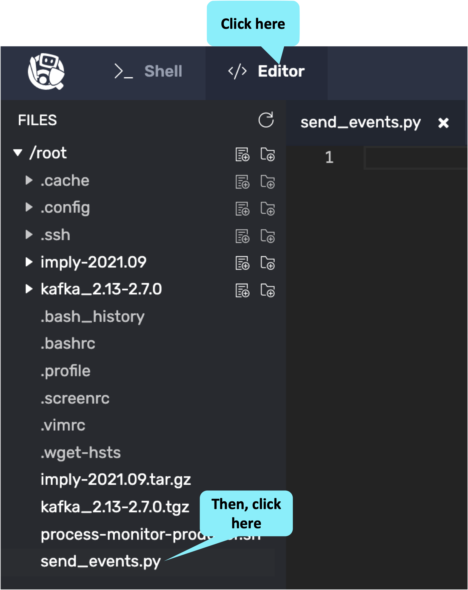

In the previous challenge we set up Kafka and produced Kafka messages.
In this challenge we will write a Python program that reads the messages from Kafka and pushes them to Polaris.

<h2 style="color:cyan">Step 1</h2><hr style="color:cyan;background-color:cyan;height:5px">

Switch to the editor tab and open the empty file named <i>send_events.py</i>.

<a href="#img-3">
  
</a>
<a href="#" class="lightbox" id="img-3">
  
</a>

<h2 style="color:cyan">Step 2</h2><hr style="color:cyan;background-color:cyan;height:5px">

Copy the following code and paste it in the editor.

<details>
  <summary style="color:cyan"><b>What does this code do? Click here.</b></summary>
<hr style="color:cyan">
We could send every record to Polaris as soon as it is generated, but that might cause a lot of overhead that we can avoid with buffering.
This code demonstrates buffering by reading and buffering records (until at least 1000 characters are in the buffer) and then printing them out to the terminal.
<br>
You can ignore the comments for now - they are there to help us know where to paste the code in the next step.
<hr style="color:cyan">
</details>

```
import json
import os
import sys
from kafka import KafkaConsumer


# Start preamble code

# End preamble code

consumer = KafkaConsumer('process-monitor', bootstrap_servers = ['localhost:9092'], value_deserializer=lambda m: json.loads(m.decode('utf-8')))

BUFFER_FLUSH_SIZE = 1000
buffer = ''
record_count = 0
for record in consumer:
  buffer += str(record.value).replace("'", '"')+'\n'
  record_count += 1
  if len(buffer) >= BUFFER_FLUSH_SIZE:
    print(buffer)
    # Start send events code

    # End send events code

    buffer = ''
```

<h2 style="color:cyan">Step 3</h2><hr style="color:cyan;background-color:cyan;height:5px">

Save the file.

<a href="#img-4">
  
</a>
<a href="#" class="lightbox" id="img-4">
  
</a>

<h2 style="color:cyan">Step 4</h2><hr style="color:cyan;background-color:cyan;height:5px">

Switch back to _Shell_.

<a href="#img-5">
  
</a>
<a href="#" class="lightbox" id="img-5">
  
</a>

<h2 style="color:cyan">Step 5</h2><hr style="color:cyan;background-color:cyan;height:5px">

Start the Kafka producer in the background.
It will run for several minutes.

```
/root/process-monitor-producer.sh ISO JSON 3600 | \
  /root/kafka_2.13-2.7.0/bin/kafka-console-producer.sh --broker-list localhost:9092 --topic process-monitor > /dev/null &
```

<h2 style="color:cyan">Step 6</h2><hr style="color:cyan;background-color:cyan;height:5px">

Try out the program to see how it works.

```
python3 /root/send_events.py
```

<h2 style="color:cyan">Step 7</h2><hr style="color:cyan;background-color:cyan;height:2px">

Use _Ctrl-C_ to exit the Kafka event consumer.

<hr style="background-color:cyan">
<p><span style="color:cyan"><strong><em>NOTE:</em></strong></span>
<i>Using the previous command, the producer will only create a fixed number of records/messages.
As we saw in the previous challenge, once the Kafka consumer has read the produced records, the consumer will appear to hang waiting for more messages.
This is why we need to manually stop the program.
<hr style="background-color:cyan">

<h2 style="color:cyan">Step 8</h2><hr style="color:cyan;background-color:cyan;height:5px">

Switch back to the editor

<a href="#img-5">
  
</a>
<a href="#" class="lightbox" id="img-5">
  
</a>

<h2 style="color:cyan">Step 9</h2><hr style="color:cyan;background-color:cyan;height:5px">

Add in the following preamble code between the first set of comments.

<details>
  <summary style="color:cyan"><b>What does this code do? Click here.</b></summary>
<hr style="color:cyan">
This code performs some one-time intial processing including:
<ul>
<li>Importing the <i>requests</i> library, which is necessary for sending events using http</li>
<li>Does a sanity check of the commandline arguments</li>
<li>Sets up the URL we will use to send events to Polaris</li>
<li>Creates the headers we will use for sending events to Polaris</li>
</ul>
<hr style="color:cyan">
</details>

```
import requests

if len(sys.argv) != 3:
  print('Usage: Python3 '+sys.argv[0]+' TABLE_ID TOKEN')
  exit(-1)

url = "https://api.imply.io/v1/events/"+os.getenv('TABLE_ID')

headers = {
  'Authorization': 'Bearer {token}'.format(token=os.getenv('IMPLY_TOKEN')),
  'Content-Type': 'application/json'
}
```

<h2 style="color:cyan">Step 10</h2><hr style="color:cyan;background-color:cyan;height:5px">

Add this code to send events to Polaris between the second set of comments.

<details>
  <summary style="color:cyan"><b>What does this code do? Click here.</b></summary>
<hr style="color:cyan">
This code sends the events to Polaris and prints the response.
<hr style="color:cyan">
</details>

```
    response = requests.request("POST", url, headers=headers, data=buffer)
    print(response)
```

<h2 style="color:cyan">Step 11</h2><hr style="color:cyan;background-color:cyan;height:5px">

Save the file.

<a href="#img-11">
  
</a>
<a href="#" class="lightbox" id="img-11">
  
</a>

<h2 style="color:cyan">Step 12</h2><hr style="color:cyan;background-color:cyan;height:5px">

Switch back to _Shell_.

<a href="#img-12">
  
</a>
<a href="#" class="lightbox" id="img-12">
  
</a>

<h2 style="color:cyan">Step 13</h2><hr style="color:cyan;background-color:cyan;height:5px">

Use the following command to generate and send events to Polaris.

```
python3 /root/send_events.py $TABLE_ID $IMPLY_TOKEN
```

<h2 style="color:cyan">Hey! It's that easy to stream Kafka events to Polaris!</h2>

<style type="text/css" rel="stylesheet">
.lightbox { display: none; position: fixed; justify-content: center; align-items: center; z-index: 999; top: 0; left: 0; right: 0; bottom: 0; padding: 1rem; background: rgba(0, 0, 0, 0.8); }
.lightbox:target { display: flex; }
.lightbox img { max-height: 100% }
.thumbnail:hover {
    position:fixed;
    top:-25px;
    left:-35px;
    width:500px;
    height:auto;
    display:block;
    z-index:999;
}
</style>
