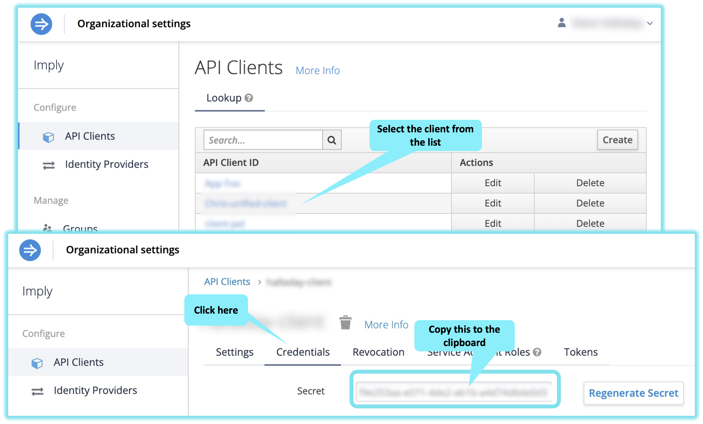
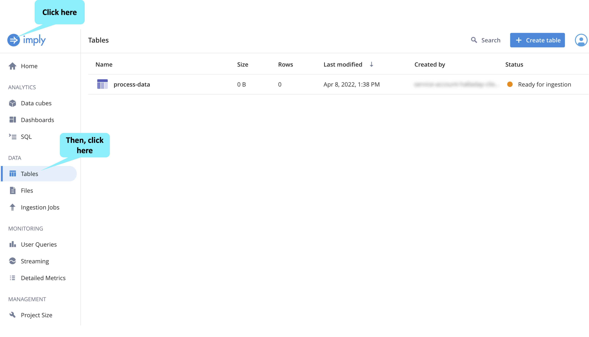

Let's create a Polaris table and start streaming data into it.

We will start by setting up some environment variables and using these to create a table and define its schema.

<h2 style="color:cyan">Step 1</h2><hr style="color:cyan;background-color:cyan;height:5px">

In the Shell, save your organization's name in a variable by replacing _&lt;your org name goes here&gt;_ with your organization's name.
This is the name of the organization you used when you signed up for Polaris.

<details>
  <summary style="color:cyan"><b>Don't remember your organization name? Click here.</b></summary>
<hr style="color:cyan">
In the Polaris user interface, click on the user icon in the top-right corner.
Then, select <i>Usage and billing</i>.
<a href="#img-1">
  
</a>
<a href="#" class="lightbox" id="img-1">
  
</a>
<hr style="color:cyan">
</details>

```
export ORGANIZATION_NAME=<your org name goes here>
```

<h2 style="color:cyan">Step 2</h2><hr style="color:cyan;background-color:cyan;height:5px">

Open a new browser tab and go to your Polaris account.
You can open the tab by running the following command and then clicking on the resulting link.

```
echo https://$ORGANIZATION_NAME.app.imply.io/
```

<h2 style="color:cyan">Step 3</h2><hr style="color:cyan;background-color:cyan;height:5px">

If you already have an API Client, you can skip this step.
But if you don't have one, in the Polaris user interface, create an API client.

<details>
  <summary style="color:cyan"><b>What is an API Client? Click here.</b></summary>
<hr style="color:cyan">
An API Client is the credentials we can use when accessing the Polaris APIs.
Learn more <a href="https://docs.imply.io/polaris/oauth/#create-a-custom-api-client" target="_blank">here</a>.
<hr style="color:cyan">
</details>

Here are the instructions.

<a href="#img-2">
  
</a>

<a href="#" class="lightbox" id="img-2">
  
</a>

<h2 style="color:cyan">Step 4</h2><hr style="color:cyan;background-color:cyan;height:5px">

In the Shell, save your API Client ID in a variable by replacing _&lt;your API client ID goes here&gt;_ with the ID of the API Client (e.g., the API Client ID from the previous step).

```
export CLIENT_ID=<your API client ID goes here>
```

<h2 style="color:cyan">Step 5</h2><hr style="color:cyan;background-color:cyan;height:5px">

In the Shell, prepare to store the client secret in a variable by copying and pasting the following command into the shell.
DO NOT EXECUTE THIS COMMAND YET!!!

```
export CLIENT_SECRET=<your client secret goes here>
```

<h2 style="color:cyan">Step 6</h2><hr style="color:cyan;background-color:cyan;height:5px">

In the Polaris user interface, copy the client secret to the clipboard.
Then back in the shell, replace _&lt;your client secret goes here&gt;_ with the secret from the clipboard and execute the command.

<a href="#img-5">
  
</a>

<a href="#" class="lightbox" id="img-5">
  
</a>
<hr style="color:cyan">

<h2 style="color:cyan">Step 7</h2><hr style="color:cyan;background-color:cyan;height:5px">

The API Client needs the following roles:
- AccessQueries
- ManageFiles
- ManageIngestionJobs
- ManageStreams
- ManageTables

In the Polaris user interface, add any missing roles to the API Client.

<a href="#img-6">
  
</a>

<a href="#" class="lightbox" id="img-6">
  
</a>

<h2 style="color:cyan">Step 8</h2><hr style="color:cyan;background-color:cyan;height:5px">

In the Shell, create an environment variable with a unique table name.
Note the resulting name of the table (using the _echo_ command).

<details>
  <summary style="color:cyan"><b>Why do we want a unique table name? Click here.</b></summary>
<hr style="color:cyan">
You can name the table whatever you like, so feel free to set the value of <i>TABLE_NAME</i> as you wish.
In this example, we add a small random number to the table name to prevent a table name collision.<br>
For example, imagine two people from the same organization working through this training and creating tables with the same names.
This name collision would be confusing, so we avoid it by slightly randomizing the table name.
<hr style="color:cyan">
</details>

```
export TABLE_NAME="process-data-$[$RANDOM % 100]"
echo $TABLE_NAME
```

<h2 style="color:cyan">Step 9</h2><hr style="color:cyan;background-color:cyan;height:5px">

In the Shell, create the Polaris table and begin streaming data into it using the following script.

<details>
  <summary style="color:cyan"><b>What does this script do? Click here.</b></summary>
<hr style="color:cyan">
This script is a bit lengthy, so feel free to review its details in the editor tab.<br>
To summarize, the script does the following:
<ol>
<li>Gets an access token for performing API accesses</li>
<li>Creates a Polaris table</li>
<li>Gets the newly created table's ID</li>
<li>Defines the schema for the table</li>
<li>Creates a Kafka topic named <i>process-monitor</i></li>
<li>Starts a process that streams events to the Kafka topic</li>
<li>Launches a process to read the events from the Kafka topic and push them to the Polaris table</li>
</ol>
<hr style="color:cyan">
</details>

```
/root/setup-table.sh
```

<h2 style="color:cyan">Step 10</h2><hr style="color:cyan;background-color:cyan;height:5px">

In the Polaris user interface, notice that the table now shows up in the list of tables.

<a href="#img-13">
  
</a>
<a href="#" class="lightbox" id="img-13">
  
</a>
<h2 style="color:cyan">Great! You created a Polaris table and are streaming data to it!</h2>


<style type="text/css" rel="stylesheet">
.lightbox { display: none; position: fixed; justify-content: center; align-items: center; z-index: 999; top: 0; left: 0; right: 0; bottom: 0; padding: 1rem; background: rgba(0, 0, 0, 0.8); }
.lightbox:target { display: flex; }
.lightbox img { max-height: 100% }
.thumbnail:hover {
    position:fixed;
    top:-25px;
    left:-35px;
    width:500px;
    height:auto;
    display:block;
    z-index:999;
}
</style>
