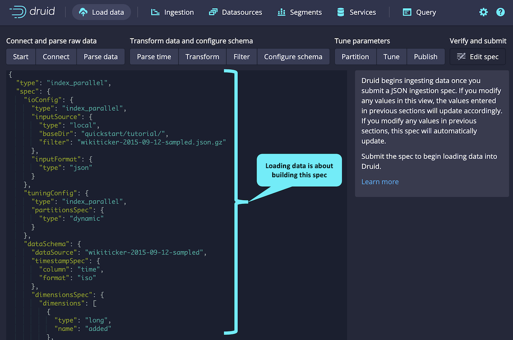
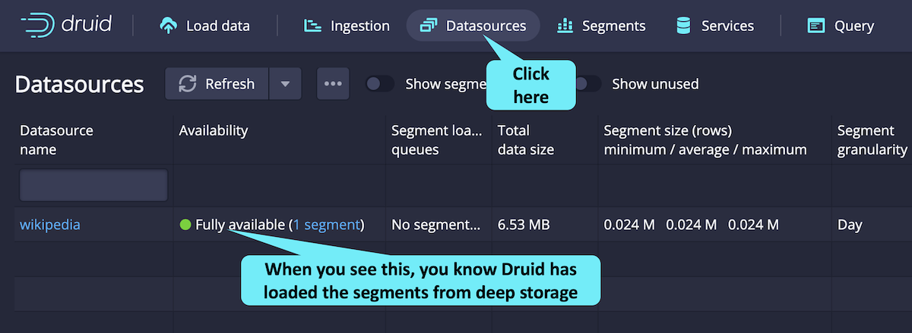

  
<b>Want to know about Druid ingestion? Click here!</b>

Druid ingestion is about connecting and preparing data for Druid to use.
As you can see in the Druid console Data Loading screen, there are four main steps to ingestion.
These steps include:
<ol>
<li><b>Connect and parse raw data</b> - this is about getting the data into a usable format</li>
<li><b>Transform data and configure schema</b> - this step makes sure you have the right dimensions</li>
<li><b>Tune parameters</b> - this step prepares the rows of data</li>
<li><b>Verify and submit</b> - the final step is for Druid to consume the data</li>
</ol>

Within each of these steps are several activities, which we will explain in other courses.
  
The whole point of these various steps is to create a specification file that Druid will use to ingest the data.
You can see this specification on the left side of the <i>Submit</i> screen.

With Druid running, let's look at the Druid console (on the left) and ingest some data.

<h2 style="color:cyan">Step 1</h2>

Load data by clicking as shown.

<h2 style="color:cyan">Step 2</h2>

The console walks you through the ingestion steps.
Since we are using example data, we can just accept the defaults by clickng the _Next:...->_ buttons.

<strong><em>NOTE:</em></strong> <i>In this introductory track, we will not cover the details of ingestion, but the purpose of the previous screens through which we wildly clicked was to build an ingestion specification.
You can review the JSON ingestion specification on left side of this final screen.
You can learn about ingestion in the Druid Basics course and the Ingestion and Data Modeling course at <a href="https://learn.imply.io/" target="_blank">learn.imply.io</a>.</i>

<h2 style="color:cyan">Step 3</h2>

Finally, click _Submit_ to ingest the data.

The ingestion takes a minute or so.
You will know Druid has written the segments to deep storage when you see the _SUCCESS_ status (you may have to scroll the window to the right).

<h2 style="color:cyan">Step 4</h2>

After Druid writes the segments to deep storage, it then loads the segments for querying.
You can tell the segments are loaded and ready when you see this (you may need to refresh the browser tab a few times).

<h2 style="color:cyan">Cool! You have ingested the data!</h2>

